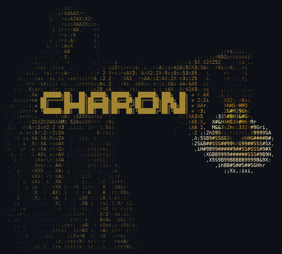

<p align="center">
  
</p>

<p align="center">
  <strong>A single-user agent operating system.</strong><br/>
  Persistent agents with real memory, parallel worker swarms,<br/>
  and everything running locally.
</p>

---

## Install

Development install from source:

```bash
git clone https://github.com/DanielSuncost/charon.git
cd charon
./scripts/install.sh
charon
```

`install.sh` handles first-time machine setup on macOS and Ubuntu, then runs the project installer. It installs system prerequisites, Python dependencies, Playwright + Chromium, builds the Rust TUI, and symlinks `charon` into `~/.local/bin`.

If `~/.local/bin` is not on your `PATH`, run:

```bash
./charon
```

`./charon` launches the current Rust TUI release binary at:

```bash
./crates/charon-tui/target/release/charon
```

Important for development: `./charon` does **not** rebuild automatically after Rust source edits. After changing code under `crates/charon-tui/`, rebuild manually:

```bash
cargo build --release --manifest-path crates/charon-tui/Cargo.toml
./charon
```

Or run the built binary directly:

```bash
./crates/charon-tui/target/release/charon
```

Useful variants:

```bash
./scripts/install.sh --no-playwright       # first-time setup, skip browser support
./scripts/install.sh --force               # reinstall deps + rebuild after install
./scripts/install-dev.sh --force           # rerun only the project-local installer
CHARON_BROWSER_HEADLESS=0 charon           # useful for first-time x.com login
```

Once tagged releases exist, a curlable install path is also available:

```bash
curl -fsSL https://raw.githubusercontent.com/DanielSuncost/charon/master/scripts/install-remote.sh | bash
```

More detail: [docs/install.md](docs/install.md)

---

## Why Charon

Other agent frameworks give you one agent, one session, no memory.
You re-explain context every time. Charon is different:

- **Judge Loops.** Give any task a quality bar and Charon iterates
  toward it autonomously. Spawn a Judge — aesthetic, quantitative,
  test-based, or LLM-scored — and an implementation loop that refines
  until the score converges. Optimize RL reward, tighten prose, hit
  a latency target, or raise test coverage, all with the same primitive.
  [How it works →](#judge-loops)
- **Real memory.** Every conversation is indexed locally. Agents recall
  past discussions by meaning, know when facts have changed, and learn
  your preferences once across all agents and projects. Scores
  [78.8% on LongMemEval_S](https://github.com/xiaowu0162/LongMemEval)
  — approaching cloud-hosted state of the art, running entirely local.
- **Parallel work.** Complex tasks decompose into shade swarms —
  ephemeral workers with scope restrictions and budget limits, running
  in parallel while you do other things.
- **Your machine, your data.** SQLite + local embeddings. No cloud
  memory service, no API keys for recall, no data leaving your machine.

---

## Session Grid & Agent Bridge

<!-- TODO: screenshot of session grid -->

The Session Grid (F3) is a live terminal multiplexer embedded directly in the Rust TUI. Each cell is a real VTE terminal emulator — you see the full rendered output and can type into any session without leaving Charon.

Sessions can be:
- **Native Charon agents** — spawned with a real PTY via `portable-pty`
- **Existing tmux sessions** — attached via `tmux capture-pane -e` (ANSI-preserving) with input written directly to the pane TTY
- **External agents** wrapped via Charon's Boat (pi, Claude Code, Codex, opencode, your own) — connected via Unix socket stream

```bash
charons-boat wrap --name review -- pi # wrap pi-agent, appears in grid
```

Every wrapped agent appears in the Session Grid. Select it with arrow keys, press Enter to focus, and type to interact — all without switching windows or tmux panes.

**What this means in practice:** unlike tools that only let you *observe* agent sessions (status, branch, last output), Charon's Session Grid lets you fully *participate* — send input, see real-time output, resize — from one unified view across all your sessions, local or remote.

---

## Live Conversation Rooms

<!-- TODO: screenshot of F4 live conversation rooms -->

Charon also supports live multi-agent conversation rooms in the TUI (F4). A room combines:
- a live event stream
- a transcript view
- per-participant session panes
- turn-taking/orchestration managed by Charon

Rooms can be created with slash commands or plain language:

```text
/conversation hermes strategist critic training agent models from agent harness traces
start a strategist/critic conversation between two hermes agents about training agent models from agent harness traces
```

Current conversation archetypes include:
- **peer**
- **teacher/student**
- **debate**
- **researcher/reviewer**
- **pair-programmers**
- **strategist/critic**
- **planner/critic**
- **architect/reviewer**
- **optimist/skeptic**

Agents in a room can use tools and do lightweight research, while Charon keeps turn state visible (`thinking`, `researching`, `replying`, `handoff`, etc.) and nudges long research turns back toward an actual conversational reply.

Natural-language room creation uses a hybrid parser:
- fast deterministic routing for obvious requests
- a fallback lightweight parser powered by the configured **shade model** for more ambiguous phrasing

Today this path is strongest with Hermes and Boat-wrapped external agents; the broader fully agent-agnostic runtime is still being expanded.

---

## Judge Loops

Most agent frameworks run once and hand you the result. If it's wrong,
you re-prompt. Charon closes the loop: define a quality signal, and the
agent iterates until it converges.

```
You: "Optimize my RL trainer. Metric is mean episode reward from
      evaluate.py — higher is better. Only touch train.py and model.py.
      100 iterations max."

Charon: ⚙ JudgeLoop  metric=mean_episode_reward  direction=maximize
        [baseline]  142.7
        [iter  1]   148.3  cosine LR schedule                    KEPT ✓
        [iter  2]   145.1  batch size 64→128                     discarded
        [iter  3]   162.8  GAE lambda 0.95→0.98                  KEPT ✓
        ...
        [iter 19]   194.2  cosine LR + GAE 0.98 + wider net      KEPT ✓
        [iter 20]   191.0  orthogonal init                       discarded

        Converged — best: 194.2 (+36.1%), restored to iteration 19.
```

That's the quantitative case. The same primitive handles anything with a
score:

### Judge Taxonomy

| Type | Signal | Example |
|------|--------|---------|
| **Performance** | Benchmark numbers (latency, throughput, reward) | "Get p99 under 50ms" |
| **Correctness** | Test pass rate | "Fix these 12 failing tests" |
| **Coverage** | % from coverage tool | "Get store.py to 90% coverage" |
| **Aesthetic** | LLM scores 1–10 against a rubric | "Rewrite this README for clarity" |
| **Conciseness** | Token count, info density | "Compress this module" |
| **Compliance** | Lint/schema violations | "Zero type errors" |
| **Win/Loss** | Head-to-head comparison | "Which implementation handles edge cases better" |
| **Regression** | Δ from saved baseline | "Refactor without breaking anything" |
| **Security** | Vulnerability count | "Harden this endpoint" |
| **Composite** | Weighted mix of the above | "Fast, correct, and readable" |

### How It Works

A Judge Loop is a shade contract with three new concepts:

1. **A Judge** — scores each iteration (a command, a test suite, or an
   LLM with a rubric). Returns a number and a critique.
2. **A Score History** — tracks every iteration's score, what changed,
   and whether it was kept or rolled back. Detects plateaus,
   regressions, and oscillation.
3. **Convergence Criteria** — stop when the target is hit, the budget
   runs out, or improvements flatline.

Each iteration: snapshot → shade implements one change → judge scores →
keep or rollback → feed critique to next iteration. Shades get fresh
context each round — no conversation bloat.

```
implement ──► judge ──► keep/rollback ──► implement ──► judge ──► ...
     │                       │                               │
     └── score: 142.7        └── score: 162.8                └── converged ✓
```

### Aesthetic Judges

For subjective tasks, the Judge is an LLM with a rubric:

```
You: "Rewrite the README to be clearer. Score yourself on structure,
      conciseness, and approachability. Iterate until you hit 8/10."

Charon: ⚙ JudgeLoop  judge=aesthetic  rubric="structure, conciseness,
                      approachability"  target=8.0
        [iter 1]  5.0/10  "Good structure but verbose, examples unclear"
        [iter 2]  7.0/10  "Tighter, but install section assumes too much"
        [iter 3]  8.5/10  "Clear, concise, good examples. Target met ✓"
```

The rubric is freeform text. The Judge shade interprets it and returns a
numeric score plus written feedback. The feedback is injected into the
next implementer's context so it knows exactly what to fix.

### Composite Judges

Combine multiple signals with weights:

```python
judge = CompositeJudge([
    (QuantitativeJudge("pytest tests/ -x", parse="pass_rate"), 0.5),
    (QuantitativeJudge("python bench.py --p99", parse="float"), 0.3),
    (AestheticJudge(rubric="code readability"), 0.2),
])
```

### Convergence & Safety

- **Checkpoints** before every iteration (shadow git — doesn't pollute
  your repo). Rollback on regression.
- **Budgets**: max iterations, max wall time, max consecutive failures.
- **Plateau detection**: if the last N iterations all got discarded,
  the loop stops or asks for new direction.
- **Constraint checks**: run tests / linting before measuring the
  metric. If constraints fail, rollback without scoring.
- **User steering**: pause, resume, adjust the program, extend budget,
  or stop early — anytime.

### Procedures (Learning from Loops)

Successful iterations are captured as **procedures** — reusable
knowledge stored in semantic memory. Next time you optimize something
similar, the agent starts with what worked before instead of guessing.

---

## Screenshots

<!-- TODO: Replace with actual screenshots of the three views -->

| Chat | Dashboard | Sessions |
|------|-----------|----------|
| *F1 — Chat view* | *F2 — Dashboard* | *F3 — Session grid* |

---

## Memory

Most agent frameworks forget everything between conversations. The ones
that remember use cloud services you don't control. Charon keeps
everything local and searchable.

**Your agent always has context.** Every conversation starts with what
the agent already knows about you — preferences, project conventions,
recent work, and relevant facts from past sessions. This happens
automatically. You never re-explain.

**Your agent can recall anything.** Every conversation is indexed into a
local vector database. When the agent needs something specific, it
searches by meaning — not just keywords:

```
You: "What did we decide about the auth module last week?"
Agent: 3 relevant memories (4ms):
       1. Decided to migrate auth to OAuth2 with PKCE flow
       2. Auth module has a race condition in token refresh
       3. User prefers passport.js over custom auth
```

**Facts stay current.** When a new memory is similar to an existing one
but the content has changed — your 5K time improved, you moved cities,
the project switched frameworks — the engine detects the overlap via
embedding similarity, marks the old version superseded, and links them
in a chain. The agent sees both but knows which is current.
([How version detection works →](docs/plans/semantic-memory-engine.md#3-version-chains-for-knowledge-updates))

Under the hood:
- **Hybrid retrieval** — vector similarity + keyword search, merged
  with [reciprocal rank fusion](https://plg.uwaterloo.ca/~gvcormac/cormacksigir09-rrf.pdf)
- **Local embeddings** — bge-base-en-v1.5 (768d), runs on CPU, ~5ms
  per recall
- **Version chains** — similarity ≥ 0.80 with different content
  triggers an update link. Old facts stay accessible but ranked lower
- **Human-readable exports** — structured profile and project knowledge
  are always inspectable as markdown alongside the database

[Architecture →](docs/plans/semantic-memory-engine.md) ·
[Three-tier design →](docs/three-tier-memory.md)

---

## Shade Swarms

Tell an agent to do 20 things in parallel and it spawns a swarm:

```
You: "Generate test fixtures for all 6 tool modules"
Agent: [spawns 6 shades, max 6 concurrent]
       All 6 running. Check progress with /batch
```

Each shade gets its own conversation, model (configurable per complexity
tier), and scope restrictions preventing it from touching files outside
its contract. Sequential contracts for multi-step work. Parallel batches
for independent tasks.

---

## Autonomous Work

```
/autonomous on
/confirm                    — approve a proposed goal
```

The agent proposes goals, plans steps, works through them with git
checkpoints, and verifies completion. Set time and token budgets.
Interrupt anytime by sending a message. Goals are inferred from
conversation — the agent suggests what it thinks you want done and
waits for confirmation.

---

## Multi-Provider

```bash
charon                        # default provider
charon claude-code            # Claude
charon codex                  # Codex
charon lmstudio               # local models
```

Switch mid-session with `/provider`. Configure separate providers for
shades — fast models for simple tasks, strong models for complex ones.
All provider communication uses raw httpx — zero SDK dependencies.

---

## Tools

15 built-in: Read, Write, Edit, Bash, Git, Http, Search, Recall,
UserModel, ProjectKnowledge, SpawnShade, SpawnBatch, SpawnJudgeLoop,
Web, Browser.

Plus a dynamic loader: drop a `.py` file in `.charon/tools/` and
it's available after `/tools reload`. Or tell the agent to build
the tool itself.

---

## Quick Start

```bash
git clone <repo> && cd charon
uv pip install -r requirements.txt
cargo build --release --manifest-path crates/charon-tui/Cargo.toml
./charon
```

If you edit the Rust TUI, rebuild before launching again:

```bash
cargo build --release --manifest-path crates/charon-tui/Cargo.toml
./charon
```

First run:
```
/setup provider lmstudio      # or claude-code, codex, api
/setup model <your-model>
/setup complete
```

**Key commands:**
```
/idea <text>             — capture an idea
/goals                   — view goals
/confirm                 — approve a proposed goal
/autonomous on|off       — toggle autonomous mode
/provider <name>         — switch provider
/batch                   — shade swarm progress
/history                 — task history
/tools                   — list all tools
```

---

## Architecture

```
charon/
├── apps/core-daemon/              # Python agent runtime
│   ├── conversation_engine.py     # Multi-turn LLM with tool use and steering
│   ├── memory_engine.py           # Semantic memory: vector + FTS5 hybrid search
│   ├── memory_indexer.py          # Background conversation indexing
│   ├── system_prompt_builder.py   # Layered context-aware prompt assembly
│   ├── agent_runtime.py           # Task execution with summarization
│   ├── shade_orchestrator.py      # Sequential shade contracts
│   ├── batch_orchestrator.py      # Parallel shade swarms
│   ├── judge_engine.py            # Judge Loop: iterative optimization with scoring
│   ├── checkpoint_manager.py      # Shadow git snapshots for safe rollback
│   ├── autonomous.py              # Goal-driven self-assignment
│   ├── consolidation.py           # Background user model learning
│   ├── user_model_structured.py   # 7-category structured user profile
│   ├── providers/                 # Anthropic, OpenAI, local (httpx, zero SDK)
│   └── tools/                     # 15 built-in + dynamic plugin loader
├── crates/charon-tui/             # Rust TUI (crossterm + vte + portable-pty)
│   ├── src/grid.rs                # Responsive grid layout (aspect-aware, N cells)
│   ├── src/session.rs             # SessionCell: VTE emulator + ByteStream backend
│   ├── src/backend.rs             # LocalPty · TmuxPane · BoatPane · CharonPane
│   ├── src/terminal.rs            # Screen buffer + scrollback
│   ├── src/parser.rs              # AnsiParser: VTE events → TerminalState
│   └── src/native_session.rs      # Unix socket session server
├── libs/store.py                  # SQLite persistence (WAL)
├── tools/charons-boat/            # External agent bridge
└── docs/                          # Design documents
```

---

## Status

**545 tests passing.**

Semantic recall scores **78.8% on
[LongMemEval_S](https://github.com/xiaowu0162/LongMemEval)** (state of
the art cloud-hosted: 81.6%). Retrieval accuracy: 98.5% at R@10.

### Done

- **Judge Loops** — iterative optimization with pluggable scoring
  (quantitative, aesthetic, correctness, composite), convergence
  detection, checkpoint/rollback, and procedure capture
- Semantic memory with hybrid vector + keyword search, version chains,
  temporal indexing, auto-injected context, and on-demand recall
- Structured user model (7 categories) with background consolidation
- Multi-turn conversation with streaming, tool use, and steering
- Parallel shade swarms with scope enforcement and token tracking
- Sequential shade contracts with phase lifecycle
- Autonomous goal-driven work with confirmation flow
- Multi-provider support with mid-session switching
- Dynamic tool loader (agents build their own tools)
- Agent coordination with boundary detection and intervention graph
- Git integration with agent metadata in commits
- SQLite persistence with conversation search and resume

### Planned

- Procedural memory (auto-capture and retrieve multi-step approaches)
- Per-agent provider config
- Contract templates (learned shade patterns)
- Overseer agent role
- Voice integration
- Remote agent linking

---

## Design Principles

1. **Users talk to agents, never to shades.** The user interface is
   always a persistent agent. Shades are internal workers.
2. **Source of truth is text.** The user profile, project knowledge,
   and working memory are human-readable markdown, always inspectable
   and editable. Embeddings accelerate search but don't replace the
   text record.
3. **Degrade gracefully.** No vector deps → keyword search still works.
   No dashboard → CLI works. No provider → orchestration works.
   Shade failure → agent continues.
4. **Budget everything.** Shade contracts have scope, token, and time
   limits enforced at the tool call level.
5. **Append-only truth.** Events, interventions, and phase transitions
   are never deleted.
6. **Agents build what they need.** Dynamic tool loader lets agents
   create tools at runtime.

---

## Documentation

| Document | Description |
|----------|-------------|
| [Semantic Memory Engine](docs/plans/semantic-memory-engine.md) | Hybrid retrieval, LongMemEval benchmark |
| [Three-Tier Memory](docs/three-tier-memory.md) | Context hierarchy design |
| [User Model Schema](docs/plans/user-model-schema-design.md) | 7-category structured profile |
| [Judge Loops](docs/plans/procedure-learning-and-optimization-loops.md) | Iterative optimization with pluggable judges |
| [Judge Loop Scenario](docs/plans/optimization-loop-scenario-spec.md) | End-to-end worked example |
| [Autonomous Work](docs/plans/autonomous-goal-driven-work.md) | Goal states, self-assignment |
| [System Prompt Design](docs/plans/agent-system-prompt-memory-design.md) | Layered prompt assembly |
| [Master Plan](docs/plans/MASTER_PLAN.md) | Build phases and architecture |

---

## License

MIT
