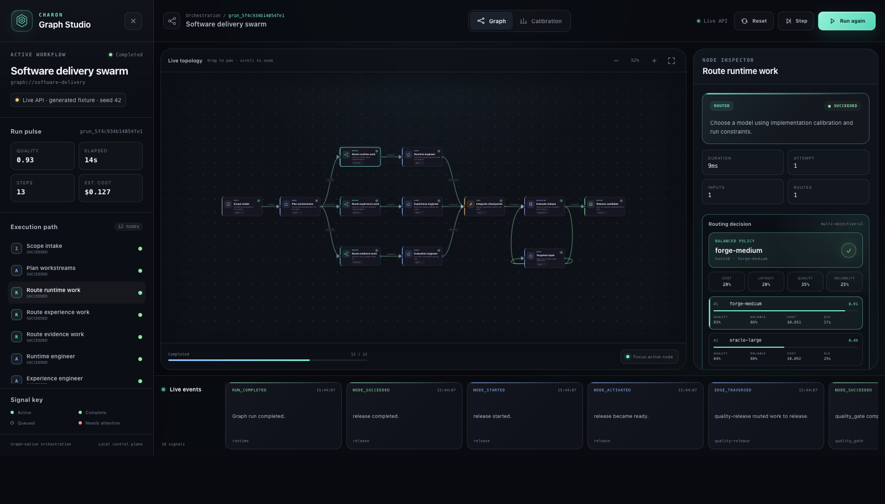

<p align="center">
  
</p>

<p align="center">
  <strong>A local-first laboratory for agentic systems.</strong>
</p>

---

Charon is my custom agent laboratory. It will continue to change
and grow as my interests change. Each capability here started as a
question I wanted to answer in running code.

Some of the key internal projects of interest to me are:
- Long running research agents with judge loops that perform evidence validation
- Long running software development teams that can do automated browser use and ios simulation testing
- A generalizable "overseer" role that can dynamically design, deploy scoped sub agents, which can also
  be promoted or retained.
- Tiered memory: session-scope, project-scope and user-scope
- Remote coordination of agents that live on separate servers
- Observable conversation rooms for traceable coordination and critique of
  long running projects, and experiments on multi-agent QUD estimation
- Automated human-oriented documentation of progress and task status
- Graph based workflows and visualizations

Some of these run today and some are still being built; the Status section
lists what works.

Everything runs locally. Memory is SQLite plus on-device embeddings, with
no cloud services for recall or context. You own the data, and so do the
agents: their identity and history live in files on your disk.
Swap the model or provider and the agent keeps its memory.

This is an active personal project and a testbed. I cannot offer support,
but I welcome suggestions and ideas.

---

## Install

```bash
git clone https://github.com/DanielSuncost/charon.git
cd charon
./scripts/install.sh
charon
```

`./scripts/install.sh` remains the recommended full install. It handles macOS
and Ubuntu, installs Python deps into a project-local venv, builds the Rust
TUI, and symlinks `charon` into `~/.local/bin`.

First run:
```
/setup provider lmstudio      # or claude-code, codex, api
/setup model <your-model>
```

More detail: [docs/install.md](docs/install.md)

For a lightweight Python install with only the agent runtime and provider
transport dependencies:

```bash
pip install .
```

Install every optional integration with:

```bash
pip install '.[all]'
```

The extras can also be installed independently:

- `.[memory]` — local embeddings and vector recall with
  sentence-transformers and sqlite-vec
- `.[browser]` — browser automation with Playwright
- `.[office]` — Excel, Word, and PowerPoint readers with openpyxl,
  python-docx, and python-pptx

---

## What's inside

Each of the following started as a question. Where a capability has limits
or produced a negative result, the section says so.

### Memory

*How should an agent remember across sessions and projects?*

Every conversation is indexed into a local vector database. Agents
recall past discussions by meaning and learn your preferences once
across all projects. Retrieval runs fully on-device: bge-base-en-v1.5
embeddings plus sqlite-vec with an FTS5 keyword index, ~10ms per recall.
No cloud calls for recall.

What it actually does, measured on a LongMemEval_S subset: plain vector
search carries it. The FTS5 plus reciprocal-rank-fusion "hybrid" adds
nothing on abstractive questions, and version-chain update-detection
gives no measurable retrieval gain. Single-session recall is
near-saturated; multi-session is the hard case (recall@1 ~0.27).
Reproduce with the eval scripts under `scripts/experiments/`
(`exp_memory_ablation.py`, `exp_memeval.py`).

[Three-tier design](docs/three-tier-memory.md)

### Specialists

*Can an agent hold a durable identity and role across model swaps?*

Long-lived agents with roles you assign. A specialist carries a standing
charter injected into every task's system prompt, accumulates working
memory and episodic history under its own agent id, and records decisions
with rationale that you, or any other agent, can query later: *who
decided this, when, and why*.

```
/specialist create release-engineer
/specialist create security-engineer
/specialist assign AG-0007 "database reliability engineer"
```

Built-in templates: `release-engineer`, `feature-engineer`,
`security-engineer`, `optimization-engineer`, or assign any custom
specialization. Assigned roles are locked: the auto-labeler that tags
generalist agents by their recent work never overwrites a specialist
you named.

### Shades

*How do you parallelize agent work without letting workers step on each other?*

Ephemeral worker agents with their own conversation, model, and scope
restrictions. An agent can spawn shades to do work in parallel, and each
one is prevented from touching files outside its contract.

```
You: "Generate test fixtures for all 6 tool modules"
Agent: [spawns 6 shades, max 6 concurrent]
```

Sequential contracts for multi-step work. Parallel batches for
independent tasks. Budget limits on tokens, time, and iterations.

Scope is enforced on Bash and Git as well as the file tools: a command's
write targets are resolved before it runs, and anything outside the contract
is refused. This is path scoping inside the process, not OS-level isolation.

### Recursive Calls

*Can an agent call another agent the way it calls a function?*

PyKernel gives each agent a persistent Python kernel: variables, imports and
definitions survive across calls, so an agent can hold scraped pages or
dataframes as live objects instead of re-reading them through tool results
every turn. Inside it, a `charon` module exposes the agent graph as ordinary
Python:

```python
handle = charon.spawn_shade('extract the tables', scope=['data/'])  # returns immediately
result = charon.rlm('summarise the failures in build.log')          # blocks, returns the output
```

`spawn_shade` is fire-and-forget. `rlm` waits for the target and returns what
it produced. The target can be a fresh shade, an existing retained shade
(`child_agent_id`), or another running agent (`peer_agent_id`) — a peer
message goes through the real task queue and reaches that agent's own
conversation, not an inert inbox.

The rest of it is what makes recursion survivable:

- **Resumable waits.** One kernel call is capped at 300s, so `rlm` stops short
  of that ceiling and returns `{'status': 'still_running', ...}` with an id.
  Pass the id back on the next call to keep waiting instead of spawning the
  same work twice.
- **Stalled is not still-running.** If a contract goes quiet past
  `shade_contract_stall_seconds` (default 300s), the call returns `stalled`:
  the worker behind it is almost certainly dead, and resuming will not help.
- **Inherited budget.** Depth and token budget come from whatever spawned the
  kernel, so a kernel belonging to a shade deep in someone else's tree cannot
  root a new tree at its own id. `task_complexity='complex'` asks for the
  strong model tier, and is downgraded once the tree's budget is mostly spent.
- **Capped peer traffic.** Messages are capped per sender/peer pair, so two
  agents cannot message each other in an unbounded loop.
- **Judged promotion.** With `promote=True` an independent judge scores
  whether the result is a reusable finding before it reaches project memory,
  never on the worker's own say-so.
- **Trace.** Every call appends to a JSONL trace per root task under
  `state_dir/rlm/`, shaped by
  [`docs/contracts/rlm-node.schema.json`](docs/contracts/rlm-node.schema.json).

The kernel is not sandboxed: it runs at the same trust level as Bash.

### Overseer

*Who decides what a team of agents should be doing?*

An overseer runs a workspace instead of a task. It reads the sessions it
manages, keeps work items with acceptance criteria, dispatches scoped tasks
to agents, verifies each criterion before accepting a result, and reports.
Completion is evidence-gated: an item cannot pass without a recorded
verification for every required criterion.

`charon.workspace` holds the records, state machines, hash-chained event
store and projections behind it, interchangeable with Acheron's JavaScript
kernel over the same schema. The tools an overseer drives are specified in
[`docs/contracts/overseer-tools.json`](docs/contracts/overseer-tools.json)
and run over local tmux, charond, or fleet transports.

Charon also serves those tools over MCP stdio:

```bash
python -m charon.mcp_server --profile overseer
```

A Claude Code or Codex session pointed at that drives a Charon workspace
with the same role document, whether the tools come from Charon or Acheron.

### Graph Control Plane

*Can a multi-agent run be executable, inspectable, and measurable as one graph?*

Charon Graph adds durable directed workflows alongside the existing agent,
shade, batch, and judge-loop paths. Nodes can branch, fan out to parallel
workers, join on evidence, loop through repair, suspend for input, and resume
after a process restart. Queue-backed nodes dispatch ordinary Charon tasks, so
graph workflows reuse the same agents, providers, scopes, and approvals.

Every route is inspectable. The model router records the eligible candidates,
hard-constraint rejections, calibrated quality estimate, uncertainty, expected
latency and cost, versioned policy weights, final ranking, and the provider and
model that actually execute a routed task. Separate model trials build
task-family calibration profiles; matched policy runs produce
scenario-clustered confidence intervals, pairing diagnostics, and Pareto
analysis.



Launch the local visual control plane:

```bash
.venv/bin/python scripts/charon_graph.py validate
.venv/bin/python scripts/charon_graph.py serve
```

The canvas shows live topology, animated handoffs, node attempts and outputs,
routing rationale, event history, and the calibration evidence behind a policy.
The included software-delivery workflow uses a byte-reproducible, explicitly
synthetic calibration/evaluation fixture and deterministic worker handlers, so
launching the Studio never contacts a model provider. The separate
[`routed-worker.json`](examples/graph_workflows/routed-worker.json) template
connects the same router contract to the ordinary Charon task queue; replace its
owner, model, and operator priors before running it against a configured worker.

[Architecture](docs/architecture/graph-control-plane.md) ·
[Evaluation method](docs/evaluation/routing-calibration.md)

### Judge Loops

*Can an agent reliably improve its own work against a quality signal?*

Define a quality signal and Charon iterates: snapshot, implement,
judge, keep-if-better or rollback, repeat, converge. Checkpoints use
a shadow git repo so your working tree stays clean, and rollback is
byte-exact (it also removes files a discarded iteration added).

A real, reproducible run (`scripts/judge_loop_example.py`) optimizing a
program's printed metric, where the keep/rollback machinery is the point:

```
tick  action     score  kept   best
1     baseline   10.0   -      10.0
2     iterated   68.0   True   68.0     # improvement, kept
3     iterated   38.0   False  68.0     # regression, rolled back via shadow git
4     iterated   308.0  True   308.0    # hit target -> converged (1 rollback)
```

This run uses the deterministic Quantitative judge (the score is the
program's output, no LLM), so it reproduces exactly. The LLM-implementer
path, where a model proposes each change, also runs end-to-end: it
reads a frozen checker, edits within its scope, and converges, with the
frozen-file and rollback gates holding. Demonstrated on small tasks, not
a benchmarked agent capability.

| Judge type | Signal | Example |
|------------|--------|---------|
| Performance | Benchmark numbers | "Get p99 under 50ms" |
| Correctness | Test pass rate | "Fix these 12 failing tests" |
| Aesthetic | LLM scores against a rubric | "Rewrite for clarity" |
| Composite | Weighted mix | "Fast, correct, and readable" |

### Autonomous Research (Libris)

*Can a swarm of agents produce genuinely-cited research, not confident prose?*

```
/libris research the role of reinforcement learning in the brain during skill vs language learning
```

The TUI opens a research-standard selector after intake. Use <kbd>↑</kbd>/<kbd>↓</kbd>
and <kbd>Enter</kbd> to choose and launch, or <kbd>Esc</kbd> to cancel. Press
<kbd>F4</kbd> to inspect the live coordinator, topic fanout, agent activity,
and communication graph.

Check the latest operation directly with `/libris status`, or inspect a specific
run with `/libris status <operation-id>`. Once a delivery is validated, F1
shows a one-shot completion notice with the absolute path to the primary report.
F4 keeps the delivery summary visible alongside the swarm; press <kbd>Tab</kbd>
to focus its details, then use <kbd>↑</kbd>/<kbd>↓</kbd> or
<kbd>Page Up</kbd>/<kbd>Page Down</kbd> to inspect every artifact path.

Read-only research source access is approved automatically by default. Use
`/libris approvals ask` to require confirmation, `/libris approvals auto` to
restore automatic source access, or `/libris approvals` to inspect the current
policy. This setting applies only to read-only research source retrieval;
mutating or otherwise dangerous actions remain approval-gated.

Libris is a multi-agent research swarm: a coordinator scouts topics,
researchers investigate them against the live scholarly literature
(arXiv, Semantic Scholar, OpenAlex), and a judge critiques the drafts.
Every claim is graded for **confidence** and **evidence strength**, and
contradicting evidence is surfaced rather than smoothed over. Results
render to a self-contained, citation-linked HTML report.

**See real output:** three fully-cited demo reports on frontier science
questions (RL in the brain, gut microbiome and neurodegeneration,
epigenetic aging clocks), with every source cross-checked against
CrossRef and arXiv. Browse them rendered at the
[**demos index**](https://danielsuncost.github.io/charon/demos/libris/),
or see [demos/libris/](demos/libris/).

### Autonomous Work

*How far can an agent get on a goal it set for itself?*

```
/autonomous on
```

The agent proposes goals inferred from conversation, plans steps, works
through them with git checkpoints, and verifies completion. Set time
and token budgets. Interrupt anytime.

### Conversation Rooms

*What happens when several agents deliberate instead of one answering?*

Multi-agent conversation rooms where two or more agents discuss a
topic with structured turn-taking. Charon manages orchestration and
keeps turn state visible.

```
/conversation hermes strategist critic <topic>
```

Archetypes: peer, teacher/student, debate, strategist/critic,
architect/reviewer, pair-programmers.

### Skills

*What should an agent read before it touches this repo?*

`skills/` holds the procedures an agent working in Charon is expected to
follow, one directory per skill: `system-map`, `systematic-debugging`,
`tdd`, `spikes`, `code-review`, and `exploratory-qa`. They are written
against real Charon commands, paths and invariants rather than general
advice, and each one ends with the claims it is not allowed to make.

`code-review` and `exploratory-qa` produce the same five-field review
artifact ([`docs/review-artifact.md`](docs/review-artifact.md)), which is
checkable rather than prose:

```bash
python3 skills/code-review/review_artifact.py check <file>
```

### Capability Assimilation

*Can an agent study another agent's codebase and take what works?*

```
/harvest_souls
```

Scans peer agent repositories — their tools, skills and prompts — and
reports what Charon is missing, with the source path behind each finding.
`/harvest_souls evaluate` grades the candidates, so the output is a ranked
decision rather than a dump. The skills above came out of that process.

### Remote Coordination (Harbor)

*Does coordination hold up when the agents are on different machines?*

Dispatch structured tasks to agents on remote machines. The local
Charon (the "Harbor") builds a context packet from memory and project
knowledge, sends it over SSH, and the remote worker executes it.
Workers can query Harbor's memory mid-task. Results and new memories
flow back and get indexed locally.

```
/voyage dispatch gpu-box agent-01 "run the full benchmark suite"
```

### Session Grid

*The substrate: one terminal that holds every agent and session.*

A terminal multiplexer built into the TUI. Each cell is a real VTE
terminal emulator. You see rendered output and type into any session
without leaving Charon.

Sessions can be native Charon agents, existing tmux sessions, or
external agents (Claude Code, Hermes, pi, Codex) wrapped via
Charon's Boat and connected over Unix sockets.

```bash
charons-boat wrap --name review -- pi   # appears in grid
```

### Multi-Provider

*Keep the agent, swap the brain.*

```bash
charon claude-code      # Anthropic
charon codex            # OpenAI
charon lmstudio         # local models
```

Switch mid-session with `/provider`. Separate provider config for
shades. All provider communication uses raw httpx, with no SDK
dependencies.

### Tools

Built-in: Read, Write, Edit, Bash, Git, Http, Search, Recall,
UserModel, ProjectKnowledge, SpawnShade, SpawnBatch, SpawnJudgeLoop,
Web, Browser, PyKernel, and more.

Dynamic loader: drop a `.py` file in `.charon/tools/` and it's
available after `/tools reload`.

**Browser** drives one local Chromium through Playwright with no other
dependency. Interactive elements are tagged in-page with ids bound to the DOM
node rather than to a position, so a reference survives reflow and
lazy-loaded rows. Every frame is walked, including cross-origin iframes.
Dialogs are answered by policy and reported in the next state instead of
blocking. When the DOM walk finds nothing usable — canvas apps, closed shadow
roots — a screenshot is described by the configured multimodal provider into a
fixed JSON shape, and the resulting refs are clickable by coordinate.

**Schema-constrained generation** returns one non-streaming completion checked
against a JSON Schema, with a repair pass and conformance failures recorded
through diagnostics. Local models get the same contract through grammar and
`json_schema` constraints, which is what makes a small local model usable as a
tool caller.

---

## Architecture

```
charon/
├── src/charon/                    # Python agent runtime (installable package)
│   ├── charon_loop.py             # Daemon entry point
│   ├── mcp_server.py              # Charon's tools over MCP stdio
│   ├── agents/                    # Agent lifecycle, runtime, policy, specialists
│   ├── conversation/              # Multi-turn LLM engine with tool use and steering
│   ├── context/                   # Context store, compaction, system prompts
│   ├── memory/                    # Hybrid vector + FTS5 search, episodic, consolidation
│   ├── libris/                    # Research operations (Libris)
│   ├── judge/                     # Iterative optimization with scoring
│   ├── shade/                     # Sequential shade contracts
│   ├── automation/                # Schedulers, batch shade swarms, checkpoints
│   ├── orchestration/             # Durable step and directed-graph runtimes
│   ├── routing/                   # Calibrated multi-model routing policies
│   ├── evaluation/                # Paired agentic benchmarks and statistics
│   ├── devop/                     # Devop orchestration
│   ├── fleet/                     # Remote dispatch (Harbor protocol), fleet sync
│   ├── workspace/                 # Overseer records, state machines, event store
│   ├── providers/                 # Anthropic, OpenAI, local (httpx)
│   ├── tools/                     # Built-in + dynamic plugin loader
│   └── infra/                     # SQLite persistence (WAL), diagnostics, registry
├── crates/charon-tui/             # Rust TUI (crossterm + vte + portable-pty)
│   ├── src/main.rs                # Event loop, views, rendering
│   ├── src/backend.rs             # LocalPty, TmuxPane, BoatPane, CharonPane
│   ├── src/terminal.rs            # Screen buffer + scrollback
│   └── src/clipboard.rs           # Cross-platform clipboard (pbcopy, OSC52)
├── tools/charons-boat/            # External agent bridge + Harbor worker
├── skills/                        # Procedures agents follow in this repo
└── docs/                          # Design documents
```

---

## Status

Active development. Used daily as a primary working environment.

CI runs ruff and the Rust build on every push. The Python test job has been
failing since 2026-07-16 and is not fixed yet; the suite passes locally
(1522 passed, 1 skipped, most recently 2026-09-14).

On 2026-09-14 Charon resolved 9 of 10 tasks on a mixed subset of
terminal-bench-core 0.1.1 — three easy, five medium, two hard, across seven
categories — running on the configured codex route. The one miss, `fix-git`,
was a byte-exactness failure: the fix was right, but the edit left a trailing
newline the grader would not accept. Ten tasks out of eighty is a signal, not
a population estimate, and this dataset is not Terminal-Bench 2.0, so the
number is not comparable to the published 2.0 leaderboard.

What works:
- Memory recall and user-model / preference consolidation
- Shade swarms with scope enforcement, including Bash and Git
- Overseer workspaces: work items, scoped dispatch, evidence-gated completion
- Charon's tools served to other agents over MCP stdio
- Durable graph workflows with routing and live projection
- Routing calibration and paired policy evaluation
- Judge loops with checkpoint/rollback
- Multi-provider (Claude, Codex, local models), with schema-constrained output
- Session grid with live VTE terminals
- Conversation rooms
- Harbor protocol for remote dispatch
- Browser automation with stable refs, every frame, and a vision fallback
- Persistent Python kernel (PyKernel)
- Dynamic tool loader

What's planned:
- MCP as a client: consuming external MCP servers as a tool registry
  ([RFC](docs/proposals/charon-mcp.md))
- Procedural memory (learned multi-step approaches)
- Per-agent provider config
- Transparent checkpoints before file mutations
- Voice integration

See [capability roadmap](docs/plans/capability-roadmap.md) for the
full list.

---

## Documentation

| Document | Description |
|----------|-------------|
| [Install](docs/install.md) | Setup on macOS and Ubuntu |
| [Three-Tier Memory](docs/three-tier-memory.md) | User / project / agent context hierarchy |
| [Procedures & Judge Loops](docs/plans/procedure-learning-and-optimization-loops.md) | Iterative optimization with pluggable scoring |
| [Autonomous Work](docs/plans/autonomous-goal-driven-work.md) | Goal-driven self-assignment |
| [Remote Agent Teams](docs/remote-agent-teams.md) | Fleet configuration, team roles, Harbor dispatch |
| [Graph Control Plane](docs/architecture/graph-control-plane.md) | Durable graph execution, events, adapters, and safety |
| [Routing Calibration](docs/evaluation/routing-calibration.md) | Routing policies, benchmark statistics, and experiment discipline |
| [Capability Roadmap](docs/plans/capability-roadmap.md) | Prioritized feature plan (P0 to P3) |
| [Master Plan](docs/plans/MASTER_PLAN.md) | Architecture and build phases |
| [Skills](skills/README.md) | Procedures an agent follows when working in this repo |
| [Review Artifact](docs/review-artifact.md) | The five-field artifact code-review and exploratory-qa produce |
| [MCP](docs/mcp.md) | Charon's tools over MCP stdio |
| [Overseer Tools](docs/contracts/overseer-tools.json) | The tool contract an overseer drives a workspace with |

---

## License

MIT
