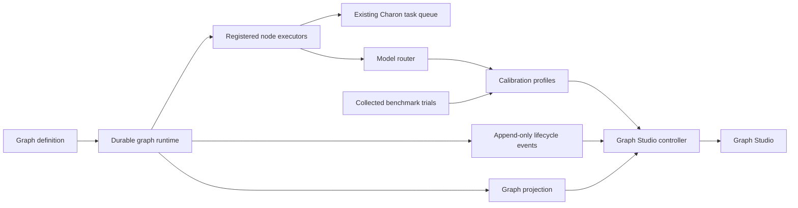

# Charon Graph Control Plane

Status: implemented experimental surface  
Schema version: integer `1`

Charon Graph adds durable, inspectable directed workflows alongside Charon's
existing step runtime, shades, batches, judge loops, Libris operations, remote
workers, and interactive sessions. Directed graphs describe workflow topology;
the shared finite-state-machine kernel separately guards durable domain
lifecycles. See [ADR-0003](../adr/0003-lifecycle-state-machines-and-workflow-graphs.md).

A graph definition supplies stable topology. A run persists scheduler state
after each transition and materializes structured lifecycle events, so an
active or historical run can be inspected without reconstructing its topology
from prose logs. `run.json`, not the event stream, is the restart cursor and
transaction commit point.

## Implemented goals

- Preserve current Charon execution paths while adding a separate graph runtime.
- Make branching, fan-out, joins, cycles, retries, and suspension explicit.
- Persist graph state after each scheduler transition.
- Schedule ready branches and independent runs fairly.
- Resolve executor code through registered handler names rather than serialized
  callables.
- Route model work with explicit hard constraints and inspectable rankings.
- Carry a selected endpoint through queue dispatch and record the endpoint that
  actually executed the task.
- Expose a presentation-neutral graph projection for user interfaces.
- Keep graph definitions JSON-serializable.

## System shape



The existing `charon.orchestration.runtime` remains available for compact,
code-defined step machines. Graph runs use a separate persistence namespace and
may dispatch work into the existing queue.

## Graph definition

The required top-level fields are:

- `graph_id`: stable graph identity.
- `entry_nodes`: one or more node IDs activated when a run starts.
- `nodes`: execution units with stable `id` and registered `handler` names.
- `edges`: directed transitions between node IDs.

`schema_version` is optional on input and defaults to integer `1`; any other
value is rejected. `title`, `max_node_visits`, `max_run_steps`, and `metadata`
are optional. A workflow revision string may be stored in `metadata`, but there
is no top-level `version` field.

Node handlers are resolved from a process-local registry. The built-in handler
names are `noop`, `fixture`, `route`, `queue_agent`, `quality_gate`, and
`human_gate`. Applications can register additional handlers.

An edge has two independent selectors:

- `on` is one of `success`, `failure`, or `always` and matches the executor
  result status.
- `route` is either a handler-supplied route label or `null`. A `null` route
  does not filter by label.

Every outgoing edge that satisfies both selectors is traversed. `always` and a
`null` route are inclusive matches; they are not lower-priority fallback rules.

## Execution semantics

### Fan-out

All matching outgoing edges are traversed in the same durable transition. Their
targets may become active together. One `tick_run` call executes at most one
ready node call, so active branches advance over subsequent ticks.

### Fan-in

Nodes support two join modes:

- `any`: activate after one incoming edge supplies a token.
- `all`: activate after every incoming edge supplies a token.

Join tokens are persisted. For an `all` join, graph authors must ensure every
incoming edge can be traversed in the intended execution path.

### Branches

An executor returns a status and may also return one or more route labels.
Status selects `success`/`failure`/`always` edges; route labels then filter edges
whose `route` is non-null. Edges with a null route remain eligible. If a
successful non-leaf node has eligible outgoing edges but its route matches none
of them, the run fails with `route_unmatched`; a miss cannot silently look like
completion.

### Cycles

Cycles are valid. Re-entering a node creates another visit. A node-specific
`max_visits` or the graph-wide `max_node_visits` bounds visits, while
`max_run_steps` bounds executor calls across the run.

### Waiting and suspension

A `wait` result keeps the node active with a durable `not_before` timestamp.
This supports polling without blocking the daemon. A waiting or retrying node
rotates behind its active siblings, so a polling branch cannot monopolize a
run. Across runs, the heartbeat orders work by the last durable tick and skips
deferred runs before applying its advancement limit.

A `suspend` result parks the run. `resume_run` selects a suspended node by
optional node ID or resume key and supplies a single-use payload to its next
executor call.

### Retries

Unhandled executor exceptions become retryable failures. Explicit failures may
also be retryable. Retries use bounded exponential backoff based on
`max_attempts` and `backoff_base_sec`. An exhausted failure traverses matching
failure edges when present; otherwise it fails the run.

### Crash behavior

The runtime persists a node claim before invoking its executor, then persists
the resulting transition. A process crash can therefore replay an executor
call. Side-effecting executors must use `NodeContext.idempotency_key`.

Each transition stores its events in an outbox inside the same atomic
`run.json` document. After that commit, the runtime appends only missing
`(sequence, event_id)` rows to `events.jsonl`, fsyncs them, and clears the
outbox in a second atomic state write. Recovery repairs a partial final JSONL
row and flushes the committed outbox idempotently. The event projection cannot
advance ahead of scheduler state during an ordinary process crash.

The `queue_agent` handler uses the idempotency key as a queue-task correlation
ID. Queue-wide file and thread locks make enqueue-if-absent atomic, and queue
saves merge concurrently appended tasks. The adapter therefore creates at most
one queued task for a node visit.

## Persistence layout

```text
.charon_state/
└── orchestration/
    └── graph_runs/
        ├── .locks/
        │   └── <run_id>.lock      # lock independent of run existence
        └── <run_id>/
            ├── definition.json   # definition snapshot
            ├── run.json          # current durable scheduler state
            └── events.jsonl      # lifecycle-event projection
```

The runtime does not rewrite `definition.json` after run creation and verifies
its canonical SHA-256 against the digest committed in `run.json` before each
tick. A missing, malformed, or altered definition quarantines that run while
other runs continue. `run.json` contains the restart state and committed event
outbox. `events.jsonl` is an audit and display projection; it is not a complete
event-sourced representation of executor outputs and state updates.

The bundled Studio loader materializes `candidate_source` files into the
definition before starting a run, so its routing inputs are covered by the
definition digest. Applications that use external source paths directly should
likewise materialize or content-address them when immutable replay is required.

## Event model

The runtime currently emits:

- `run_started`, `run_suspended`, `run_resumed`, `run_completed`,
  `run_failed`, `run_quarantined`, `run_deadlocked`, `route_unmatched`,
  `budget_exceeded`, and `run_stopped`
- `node_activated`, `node_started`, `node_waiting`,
  `node_retry_scheduled`, `node_succeeded`, and `node_failed`
- `edge_traversed`

Events include an event ID, sequence number, timestamp, run ID, graph ID, and
transition-specific fields. `node_succeeded` records returned route labels.
Executor output remains in `run.json`; the runtime does not emit separate
route-selection or queue-dispatch event types.

## Projection and Graph Studio

`project_run` returns:

- run identity, timestamps, status, step count, error, and suspension state
- projected nodes with handler, join, status, visits, attempt, output, error,
  and metadata
- projected edges with traversal status and count
- active node and edge IDs and traversed edge IDs
- a copy of the current node-state mapping

It does not read `events.jsonl` or calculate aggregate metrics.

The local Graph Studio controller combines this projection with a separate
event-file read, display metrics, the stored definition, and the bundled
calibration fixture. It recovers one tagged demonstration run on restart and
stops stale tagged runs without touching unrelated workflows. Its HTTP surface
serves one run through `GET /api/snapshot` and reset, tick, and run actions.
The server binds only to loopback, validates Host and Origin, and requires a
per-process control token plus JSON content type for mutations.

The checked-in Studio workflow is deliberately deterministic: its worker,
integration, evaluation, repair, and release nodes use fixture handlers, and
its generated model profiles are never sent to providers. This keeps the visual
demonstration reproducible and credential-free. The companion
`examples/graph_workflows/routed-worker.json` template is the executable seam:
it passes a normalized `selected_endpoint` from `route` into `queue_agent`.
Operators must replace its agent owner, model, and initial priors before use.

## Compatibility with current Charon features

Graph nodes coordinate existing capabilities through adapters:

- `queue_agent` creates an ordinary `agent_task` with owner, instruction, title,
  project, priority, scope, dependencies, correlation ID, and attempt limit,
  selected model route, and routing rationale, then polls its queue status.
- `route` can load checked-in candidates, run the calibrated router, and emit a
  selected provider/model endpoint, or delegate to the existing provider/model
  registry.
- Routed agent tasks require the selected provider and model to be available.
  They do not fall back to heuristic execution, and both the selected and
  executed endpoints are recorded so route compliance is inspectable.
- An explicit route also bypasses automatic shade decomposition, which could
  otherwise replace the selected endpoint inside child phases. Graph authors
  who want decomposition route and queue each phase as its own node.
- Official provider routes are pinned to their official endpoints. Custom
  OpenAI-compatible credentials are usable only for the matching configured
  endpoint, local credentials cannot be redirected away from the configured
  local endpoint, and candidate-supplied non-loopback route URLs require TLS.
  Registry-backed routes can use only the exact endpoint already trusted in the
  model registry. Route records never carry credentials. A process-salted
  credential identity participates in routed engine caching, so cached engines
  do not cross credential identities.
- `quality_gate` performs structured threshold or equality checks and returns a
  route label.
- `human_gate` uses the suspension and resume contract.
- Both the Charon daemon heartbeat and the interactive TUI heartbeat advance
  existing step operations and tick up to eight active graph runs once per
  cycle. A graph launched from the TUI therefore does not depend on a separate
  daemon process to make progress.

Existing operations can migrate incrementally: lifecycle state may become
FSM-authoritative while their current scheduler and read-model contracts remain
in place. A workflow moves to graph scheduling only when its topology benefits
from explicit branching, fan-out, joins, or live graph inspection.

## Validation and safety boundaries

- Unknown schema fields are rejected.
- Validation rejects malformed or duplicate IDs, missing entry nodes, missing
  edge endpoints, unreachable nodes, invalid joins, invalid edge modes, and
  malformed limits.
- Terminal nodes cannot have success or always edges.
- Definitions, configuration, metadata, outputs, updates, and resume payloads
  must be JSON-serializable.
- Executors are registered code, not functions supplied in JSON.
- The built-in quality gate uses structured comparisons, not dynamic
  evaluation.
- Run and visit budgets bound cycles.
- Definition digests fail closed; one damaged run does not stop healthy runs.
- Successful branch labels must match an eligible edge.
- The local Studio rejects remote binds and unauthenticated mutations.
- Secrets belong in provider configuration, not graph definitions or events.

## Public Python surface

```python
definition = GraphDefinition.from_dict(payload)
run = start_run(state_dir, definition, inputs={"goal": "..."})

tick_run(state_dir, run["run_id"])
snapshot = project_run(state_dir, run["run_id"])

resume_run(state_dir, run["run_id"], payload={"approved": True})
stop_run(state_dir, run["run_id"], reason="operator request")
```

Applications register custom handlers with `register_executor(name, fn)`.
Handlers receive a `NodeContext` and return an `ExecutorResult`, a compatible
dictionary, or `None`.

`tick_runs(state_dir, max_runs=8)` advances runnable runs in durable fair order
and fault-isolates unreadable or invalid runs.

## Evolution rules

- Schema version `1` is the only accepted version today.
- Preserve stored definition snapshots and existing event meanings.
- Prefer a new handler name when behavior is not backward compatible.
- Treat calibration profiles and benchmark datasets as versioned inputs.
- Add schema fields only with matching parser, serializer, validation, and
  migration decisions; unknown fields currently fail closed.
