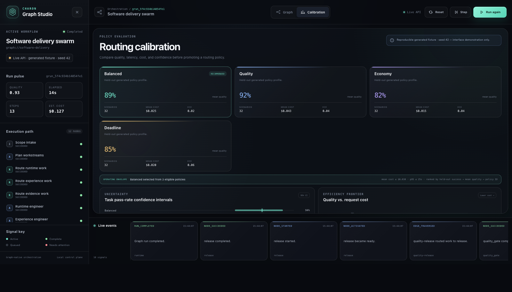

# Routing Calibration and Agentic Evaluation

Status: implemented experimental surface

Charon's router ranks supplied model candidates using explicit hard constraints,
calibration profiles, and one of four weighted policies. The evaluation module
analyzes already-collected agent trials; it does not currently run providers or
benchmark environments itself.



The checked-in Studio dataset is a generated fixture, not a claim about live
model performance. It is derived from disjoint synthetic calibration and
held-out evaluation splits, and every aggregate can be regenerated
byte-for-byte:

```bash
.venv/bin/python scripts/generate_routing_fixture.py --check
```

The fixture records hashes for its generator, routing and evaluation code, and
three raw JSONL corpora.

## Routing inputs

### Task profile

`TaskProfile` stores:

- `task_id`
- `task_family` (`task_class` is accepted as an input alias)
- `complexity`, validated in the range `[0, 1]`
- required capabilities
- required context tokens
- optional maximum estimated cost
- optional uncertainty-adjusted quality floor
- optional latency service objective
- metadata

Task family selects a matching candidate calibration profile. Complexity is
preserved in the profile but does not currently change feasibility or ranking.
Cost is supplied as a per-candidate estimate; the router does not calculate it
from separate input/output token prices.

### Model candidate

`ModelCandidate` stores:

- candidate, provider, and model IDs
- capabilities and context window
- estimated aggregate cost, latency, quality, and reliability
- an optional default calibration profile
- optional calibration profiles keyed by task family
- metadata

For a routed task, calibration lookup selects the first present profile in this
order: exact task family, `*`, then the default calibration. The selected
profile is used only when its trial count is positive; otherwise the candidate
is treated as uncalibrated and uses its declared estimates with a fixed
uncertainty reserve.

### Calibration profile

`aggregate_calibration` groups `TrialRecord` values by model. It records:

- beta-smoothed success probability
- a Wilson interval over observed success outcomes
- trial and success counts
- mean score when scores are present
- p50 and p95 latency
- mean observed cost
- Brier score and equal-width expected calibration error when predicted
  probabilities are present
- counts and beta-prior parameters

`aggregate_calibration_by_task` applies the same aggregation by task family and
returns a model-by-family grid.

The router uses calibrated mean score as quality when available and calibrated
success probability as reliability. It transfers the gap between reliability
and its Wilson lower bound to a conservative quality lower bound.

## Hard constraints

Candidates are rejected before ranking when they:

- lack a required capability
- have an insufficient context window
- exceed the maximum estimated cost
- fall below the quality floor after the uncertainty adjustment
- exceed the latency objective using calibrated p95 latency, or declared
  latency when uncalibrated

Every candidate remains in the serialized decision. Rejected candidates carry
their constraint violations and feasible candidates carry their estimates,
normalized components, weighted contributions, total score, and rank.
Decisions also record the exact normalized policy weights and
`policy_version`, so the scoring profile can be replayed rather than inferred
from a policy name.

## Policy objectives

Four built-in policies weight the same quality, reliability, cost, and latency
components:

| Policy | Primary weighting |
|---|---|
| `balanced` | Quality and reliability lead, with equal cost and latency terms |
| `quality` | Quality and reliability dominate |
| `economy` | Cost dominates |
| `deadline` | Latency dominates |

Cost and latency are normalized relative to the feasible candidate set.
Conservative quality and reliability estimates are used directly. Equal total
scores are resolved deterministically by candidate ID.

When a graph dispatches a routed queue task, the selected provider and model
are carried into agent execution. A routed task fails explicitly when that
endpoint is unsupported or lacks credentials; it does not silently execute
heuristically. Queue results record both selected and executed endpoints.
The bundled Studio workflow stops before that live boundary: its worker nodes
are deterministic fixtures and its model profiles are synthetic. The
`routed-worker.json` template and route-to-queue integration tests exercise the
executable contract without presenting generated measurements as provider
results.

## Calibration trial record

`TrialRecord` is the input to calibration aggregation:

```json
{
  "model_id": "model-b",
  "success": true,
  "latency_ms": 18420,
  "cost_usd": 0.042,
  "score": 0.91,
  "predicted_success": 0.86,
  "task_id": "repo-repair-014",
  "task_family": "implementation",
  "metadata": {
    "seed": 103
  }
}
```

## Benchmark trial record

`BenchmarkTrial` is the input to policy analysis:

```json
{
  "scenario_id": "repo-repair-014",
  "policy_id": "balanced",
  "success": true,
  "score": 0.91,
  "cost_usd": 0.042,
  "latency_ms": 18420,
  "selected_model_id": "model-b",
  "oracle_model_id": "model-b",
  "task_family": "implementation",
  "pair_id": "3",
  "predicted_success": 0.86,
  "metadata": {
    "seed": 103
  }
}
```

Policy conditions are matched by `(scenario_id, pair_id)`. Seeds are not a
dedicated `BenchmarkTrial` field; callers store them in metadata. A paired
comparison rejects matched rows whose task families or `metadata.seed` values
disagree.

## Policy summaries

`summarize_policy_trials` reports, per policy:

- trial, success, and independent-scenario counts
- scenario-macro success rate with a deterministic scenario-cluster bootstrap
  interval
- explicitly labeled raw-trial success rate and Wilson interval for diagnostics
- scenario-macro mean score and cost
- p50 and p95 over per-scenario mean latency
- selected-model counts

With fewer than two independent scenarios, headline interval bounds are null
and `interval_status` is `insufficient_scenarios`; the code does not manufacture
precision from repeated runs of one task. Summary records include interval
method, confidence level, bootstrap count, and seed.

Predicted success is preserved in each benchmark trial, but benchmark policy
summaries do not currently calculate mean prediction, Brier score, expected
calibration error, or total cost. The calibration helpers calculate Brier score
and calibration error from `TrialRecord` values.

## Paired policy comparison

`paired_bootstrap_delta` supports `success`, `score`, `cost_usd`, and
`latency_ms`. The reported delta is always contender minus baseline.
`higher_is_better` records whether the selected metric should be maximized.

Repeated pairs are clustered by scenario:

1. Match the two policies by `(scenario_id, pair_id)`.
2. Calculate each matched pair's contender-minus-baseline delta.
3. Average repeated deltas within each scenario.
4. Resample scenario means with replacement.
5. Use the requested percentile bounds as the confidence interval.

This gives each scenario equal weight and avoids treating repeated runs of one
scenario as independent tasks. The point estimate, matched-pair count,
scenario count, confidence level, bootstrap count, and seed are serialized.
Repeating the same analysis with the same inputs and seed is deterministic.

Duplicate trials for one policy and pair are rejected. The default
`missing_pair_behavior="report"` analyzes the intersection while serializing
baseline, contender, matched, and unmatched counts.
`missing_pair_behavior="error"` instead requires identical coverage. The
comparison always fails when no matched pairs remain.

An interval that crosses zero is inconclusive for a directional difference. The
module does not convert a frequentist confidence interval into a posterior
probability that one policy is better.

## Pareto analysis

The default frontier maximizes success rate and mean score while minimizing
mean cost and p95 latency. A policy is excluded when another policy is no worse
on every selected metric and strictly better on at least one. Callers may
provide different maximize and minimize field lists.

The generated fixture's recommendation is separate from Pareto membership and
is serialized as data. Its operating envelope requires mean cost at or below
`$0.03` and p95 latency at or below `25,000 ms`; eligible policies are ordered
by held-out scenario-macro success, mean score, then policy ID. Graph Studio
shows the selected policy from that rule and contains no hard-coded presentation
default. Its offline fallback carries a separate, explicitly illustrative rule
inside the embedded fixture data.
It presents the independent scenario-cluster count—not repetitions—as the
headline sample size, alongside repetitions per scenario, confidence level,
interval method/status, and the operating-envelope rule.

## Routing diagnostics

`routing_matrix_data` currently returns:

- sorted policy and selected-model IDs
- selected-model counts by policy as mappings and a rectangular matrix
- oracle-versus-selected counts as mappings and a rectangular confusion matrix
- oracle match count, trial count, and accuracy when oracle labels exist

It does not currently group by task family or calculate per-cell shares,
success, score, latency, or cost.

## Report export

`AgenticBenchmark.report` combines:

- policy summaries
- each contender's paired deltas against one baseline
- the default Pareto frontier
- routing diagnostics
- pairing and missingness diagnostics
- the baseline, metric list, interval method, bootstrap count, seed, confidence
  level, and missing-pair behavior

`BenchmarkReport.to_json` serializes the report, and `write_json` writes it to a
caller-supplied path.

## Trial collection boundary

General trial collection is deliberately outside this module. Callers run local
models, hosted APIs, coding agents, or deterministic fixtures and convert
results into `BenchmarkTrial` and, separately, `TrialRecord` values. There is no
provider runner or environment-adapter interface yet.

This separation keeps the current statistics provider-neutral while leaving
execution, timeout handling, environment setup, and scoring to the caller.

The repository does include one deterministic fixture generator to exercise
the complete analysis path:

- `examples/routing/calibration-trials.jsonl`: model outcomes on `cal-*`
  scenarios used to fit profiles
- `examples/routing/evaluation-model-outcomes.jsonl`: all-model counterfactual
  outcomes on disjoint `eval-*` scenarios
- `examples/routing/policy-benchmark-trials.jsonl`: selected held-out outcomes
  for four matched policy conditions
- `examples/routing/calibration-fixture.json`: derived Studio input with task
  calibrations, policy summaries, paired comparisons, traffic shares, and
  provenance

These records are seeded synthetic data and are explicitly labeled as not live
provider measurements.

## Recommended dataset discipline

The following practices are recommendations rather than runtime enforcement:

- Version scenario text, environment setup, and scoring logic.
- Use shared seeds across policy conditions.
- Preserve failures and timeouts as trials.
- Separate calibration and final evaluation splits.
- Do not tune a policy on the trials used for its headline comparison.
- Report trial counts, scenario counts, and unmatched pairs.
- Label generated fixtures as fixtures rather than live provider measurements.

## Reproducible analysis loop

1. State a routing hypothesis.
2. Freeze scenarios, scoring, seeds, and constraints.
3. Collect model trials for a calibration split.
4. Build default or task-family calibration profiles.
5. Collect matched `BenchmarkTrial` values for each policy.
6. Inspect policy summaries, paired intervals, routing diagnostics, and the
   Pareto frontier.
7. Change one policy assumption.
8. Repeat on the frozen split, then confirm on held-out data.

For the checked-in fixture, regenerate files into a temporary directory or
verify the committed bytes:

```bash
.venv/bin/python scripts/generate_routing_fixture.py --output-dir /tmp/charon-routing
.venv/bin/python scripts/generate_routing_fixture.py --check
```
