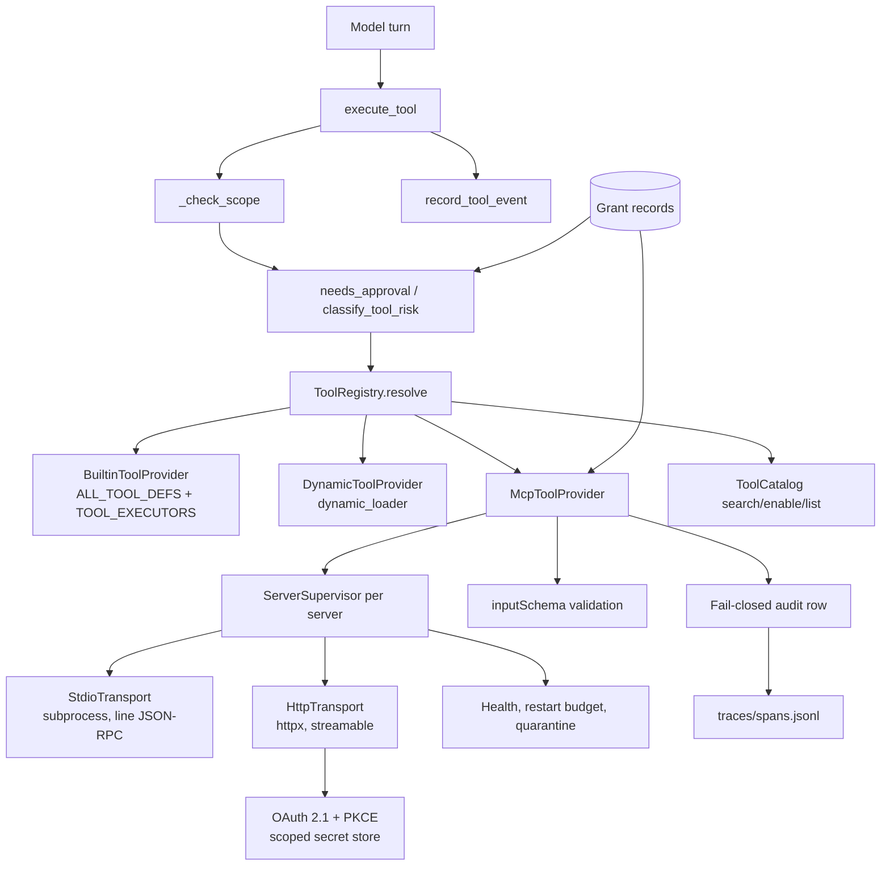

# RFC: Charon MCP Integration

- Status: proposed
- Date: 2026-09-09
- Decision owner: Charon maintainers
- Reverse direction (Charon *as* an MCP server): [`docs/mcp.md`](../mcp.md), [`src/charon/mcp_server.py`](../../src/charon/mcp_server.py)
- Contract: `mcp-server.schema.json` (to be added under [`docs/contracts/`](../contracts/))
- Conformance fixtures: `tests/contracts/mcp/` (to be added, mirroring [`tests/contracts/test_contract_schemas.py`](../../tests/contracts/test_contract_schemas.py))

## Summary

Charon already **serves** MCP. `python -m charon.mcp_server` exposes Charon's
tool registry to Claude Code, Codex and any other MCP client over stdio
(`src/charon/mcp_server.py`, documented in `docs/mcp.md`). Charon does not
**consume** MCP: there is no client, no server registry, no transport, and no
way for a third-party MCP server's tools to reach a Charon agent.

This RFC designs the consuming half. Its central commitment is a seam, not a
feature:

> MCP is **one provider behind the tool registry**, not a second tool namespace.
> Every MCP tool reaches a model through the same `ToolResult`, the same
> `execute_tool` dispatch, the same approval gate, the same scope check, and the
> same audit stream as `Read` and `Bash`.

The loop this creates is:

```text
discover -> present -> approve -> activate -> invoke -> audit
    ^                                                     |
    +--------------------- reload / quarantine -----------+
```

Getting this seam wrong is the expensive failure. A parallel namespace — an
`Mcp` tool with a `server` parameter, or a second executor dict consulted after
`TOOL_EXECUTORS` — would work on the first day and then have to be unwound
through every approval, scope, trace, and context path in the codebase. The
design below therefore spends most of its length on where MCP plugs in and on
what the current code cannot yet support.

## Decision

Build MCP consumption as a Charon subsystem with six commitments:

- A `ToolProvider` protocol is introduced under `src/charon/tools/registry.py`.
  The existing built-in registry and the existing dynamic-plugin loader each
  become a provider; MCP becomes the third. `execute_tool` routes through the
  registry instead of its current two-branch ladder.
- Both transports (local stdio subprocess, remote streamable HTTP) implement one
  `McpTransport` interface with mandatory deadlines, health probes, and
  argument schema validation before dispatch.
- Remote authorization uses OAuth 2.1 authorization-code + PKCE, reusing the
  proven pieces of `src/charon/providers/charon_auth.py` but **not** its
  hardcoded provider table, its shared `auth.json`, or its missing `state`
  comparison.
- A server's tools and the permissions they imply are presented for explicit
  human approval **before** activation. Nothing an MCP server advertises is
  callable until a person has seen the manifest digest and said yes.
- Reload is explicit and atomic; repeated failure quarantines a server rather
  than degrading every turn; every invocation is audited before it runs.
- Charon ships a native MCP server template and a conformance suite that any
  server — Charon's own included — must pass.

## Capability thesis

| Capability | Basic implementation | Charon target |
|---|---|---|
| Tool exposure | MCP tools appended to the tool array | One provider behind a registry, with the same dispatch, gate, scope and trace as built-ins |
| Discovery | All server tools always in the prompt | `ToolCatalog search`/`enable` over MCP tools, so a 60-tool server costs nothing until used |
| Transport | Spawn a process and hope | Deadline on every call, health probe, restart budget, quarantine state |
| Argument handling | Forward the model's JSON | Validate against the server's `inputSchema` locally; reject before the network |
| Authorization | Paste a token into config | PKCE + per-server scoped secrets + revocation + headless handoff |
| Consent | Trust whatever the server advertises | Manifest digest pinned at approval; a changed manifest re-prompts |
| Failure | Errors every turn forever | Consecutive-failure quarantine with an explicit un-quarantine action |
| Audit | Nothing, or a log line | Fail-closed append-only record per invocation, correlated into `traces/spans.jsonl` |
| Server authoring | Copy someone's example | In-tree template plus an executable conformance matrix |

The result should answer, for any MCP call that happened:

- Which server, which transport, which manifest digest?
- Who approved that tool, when, and against which advertised schema?
- What did the model send, and did it validate before it left the machine?
- Which credential was used, what scope did it carry, and can it be revoked?
- Why is this server quarantined, and what does un-quarantining permit?

## Goals

- Let a Charon agent use any conformant MCP server without a code change.
- Keep one tool dispatch path, one approval gate, one audit stream.
- Make a remote server's authorization survive a headless machine and a restart.
- Keep the model's prompt small no matter how many servers are configured.
- Make server failure loud, bounded, and recoverable without a restart.
- Give server authors a template and a pass/fail conformance target.
- Remain fully functional offline with only local stdio servers.

## Non-goals

- Replacing `src/charon/mcp_server.py`. Charon-as-a-server stays as it is; this
  RFC is the mirror image and shares its wire vocabulary deliberately.
- Implementing the whole MCP surface in the first release. Tools first;
  resources, prompts, sampling and elicitation are staged (see Increment 4).
- Adding the official `mcp` Python SDK as a hard dependency. `pyproject.toml`
  currently pins `httpx[http2]>=0.28` and stdlib; `src/charon/mcp_server.py`
  proves a hand-rolled JSON-RPC 2.0 line protocol is enough and testable.
- Auto-installing or auto-trusting servers from a registry index.
- Letting an MCP server mutate Charon's own configuration, approvals, or state
  directory through the tools it exposes.

## Open-source posture

- The client, both transports, the approval flow, quarantine, audit, the server
  template and the conformance suite belong in the public core.
- The server manifest schema, the grant record, and the conformance matrix are
  public compatibility contracts under `docs/contracts/`.
- Conformance fixtures run without credentials or network: a stdio fixture
  server ships in-tree, exactly as `tests/test_mcp_server.py` drives
  `charon.mcp_server` as a subprocess today.
- Credentials are never part of an exported manifest, span, audit row, or
  diagnostic record.

## Foundation already present in Charon

The integration is tractable because most of the substrate exists. Each row
below names code that is in the tree today.

| Existing Charon capability | Where | MCP use | Required extension |
|---|---|---|---|
| Tool definition + result types | `ToolResult`, `ToolContext` — `src/charon/tools/__init__.py:34`, `:42` | The type every MCP tool result becomes | Structured-content channel (see Finding 4) |
| Built-in registry | `ALL_TOOL_DEFS`, `TOOL_EXECUTORS` — `src/charon/tools/__init__.py:1454`, `:1465` | Becomes the first `ToolProvider` | Wrap, do not replace |
| Dispatch | `execute_tool` — `src/charon/tools/__init__.py:1732` | The one entry point MCP must reuse | Route via registry, not a third `if` |
| Second-source tool loading | `src/charon/tools/dynamic_loader.py` (`load_dynamic_tools`, `_dynamic_tools`, `execute_dynamic_tool`, `get_load_errors`) | The precedent for a non-built-in provider, including its name-collision rule | Generalize to a provider |
| On-demand tool activation | `TOOL_CATALOG_DEF`, `execute_tool_catalog`, `_matches` — `src/charon/tools/tool_catalog.py` | How MCP tools stay out of the prompt until needed | Provider grouping + health in `search`/`list` |
| Per-engine active/available split | `_available_tools`, `_tool_lock`, `_enable_tools`, `_tool_catalog_metadata` — `src/charon/conversation/conversation_engine.py:502`, `:503`, `:573`, `:844` | Where MCP definitions must land to be enableable | Repopulate on reload (see Finding 9) |
| Approval gate | `needs_approval`, `classify_tool_risk` — `src/charon/infra/tool_approval.py:264`, `:94`; `_request_interactive_approval`, `set_approval_callback`, `respond_to_approval` — `src/charon/tools/__init__.py:1577`, `:1520`, `:1532` | Per-call consent, already async-safe and correlated by `approval_id` | MCP risk classification; persisted per-server grants |
| Scope / frozen enforcement | `_check_scope` — `src/charon/tools/__init__.py:1664` | Shade containment | Path extraction for MCP tools (see Finding 14) |
| OAuth + PKCE | `_pkce_pair`, `_b64url`, `_run_callback_server`, `_OAuthCallbackHandler`, `_exchange_code_form/_json` — `src/charon/providers/charon_auth.py:73`, `:69`, `:149`, `:106`, `:168`, `:211` | The whole authorization-code flow, already working for Anthropic and Codex | Dynamic providers, state check, revocation |
| Headless auth handoff | `login_oauth`'s `AUTH_URL::` / `AUTH_INFO::` status emissions and the `auth_code_cb` paste fallback — `src/charon/providers/charon_auth.py:258` | Exactly the headless story MCP needs | Reuse verbatim |
| Cross-process token refresh | `locked_refresh` — `src/charon/providers/oauth_lock.py:28` | Single-use refresh tokens across concurrent Charon processes | Reuse verbatim |
| Correlated tracing | `span`, `record_span`, `new_trace_id`, `SPAN_KINDS` (`tool_call`), `traces/spans.jsonl` — `src/charon/infra/orchestration_trace.py:204`, `:227`, `:72`, `:51` | Invocation audit correlated to the owning operation | Fail-closed variant for MCP |
| Silent-degradation log | `record` (`_diag`), `diagnostics.jsonl` — `src/charon/infra/diagnostics.py:33` | Health, restart, quarantine events | Reuse verbatim |
| Tool-event memory | `record_tool_event` — `src/charon/memory/execution_memory.py:176`, called off-path from `_record_tool_event_off_path` — `src/charon/conversation/conversation_engine.py:1058` | MCP calls become recallable execution memory for free | None |
| Import-failure surfacing | `FAILED_TOOL_IMPORTS`, `_record_tool_import_failure` — `src/charon/tools/__init__.py:1379`, `:1382`; rendered by `_cmd_tools` — `apps/tui/opentui/backend/commands_core.py:496` | The presentation precedent for quarantined servers | Same shape, per server |
| Multi-step interactive flow | `_pending_fleet_setup` — `apps/tui/opentui/backend/fleet_mixin.py:18`, routed in `handle_command` — `apps/tui/opentui/backend/commands_mixin.py:209` | The model for the `/mcp add` approval wizard | Reuse the pattern |
| MCP wire vocabulary | `tool_def_to_mcp`, `tool_result_to_mcp`, `PROTOCOL_VERSION_DEFAULT`, the `JSONRPC_*` codes — `src/charon/mcp_server.py:82`, `:92`, `:29`, `:33` | Symmetric client-side codecs | Invert |
| Subprocess protocol test harness | `_run`, `INIT`, `INITIALIZED` — `tests/test_mcp_server.py:17`, `:37`, `:39` | The conformance-suite driver | Generalize to arbitrary servers |
| Hand-rolled schema validator | `_validate`, `_type_matches`, `SchemaValidationError` — `tests/contracts/test_contract_schemas.py:34`, `:16`, `:12` | Argument validation with no new dependency | Promote out of `tests/` |

## What the current code cannot support as described

This section is the point of designing first. Fourteen findings; each is a
concrete obstacle with a named location. Several are pre-existing defects that
MCP would inherit and amplify.

### Finding 1 — There is no `ToolCatalog` type to add a provider to

`ToolCatalog` is not a class, a registry, or an object. It is one tool: a
definition dict `TOOL_CATALOG_DEF` and one function `execute_tool_catalog`
(`src/charon/tools/tool_catalog.py:14`, `:58`) that reads a plain dict handed in
through `ctx.metadata['tool_catalog']` with three keys — `available`,
`active_names`, `enable` — built per-context by
`ConversationEngine._tool_catalog_metadata` (`conversation_engine.py:844`).

The real registry is two module-level dicts assembled at import time
(`ALL_TOOL_DEFS`, `TOOL_EXECUTORS`). **"MCP as a `ToolCatalog` provider type"
cannot be implemented literally, because the type does not exist.** The seam has
to be created before MCP can sit behind it. This RFC creates it (see
Architecture) and keeps `execute_tool_catalog`'s three actions unchanged.

### Finding 2 — `execute_tool` dispatch is a hardcoded two-branch ladder

`execute_tool` (`src/charon/tools/__init__.py:1732`) does scope check, approval
check, `TOOL_EXECUTORS.get(name)`, then falls back to
`dynamic_loader.execute_dynamic_tool`. Adding MCP as a third `if` is the
parallel-namespace failure in disguise: the ordering becomes load-bearing and
untestable. The lookup must be inverted into a registry resolve.

### Finding 3 — Tool names are one flat global namespace

`dynamic_loader.load_dynamic_tools` (`dynamic_loader.py:97`, name check at `:134-137`) rejects a plugin
whose name collides with a built-in, but nothing prevents two MCP servers from
both exposing `search`. Prefixing is required. Two existing behaviours then
break:

- `ConversationEngine._enable_tools` (`conversation_engine.py:573`) lowercases
  and matches **exact** names, so a prefixed name must be reproduced exactly by
  the model when it calls `ToolCatalog enable`.
- `_activate_tools_for_text` (`conversation_engine.py:596`) does a **substring**
  test of every available tool name against the whole user message
  (`if name and name.lower() in lowered`). A server exposing a tool named
  `mcp__github__list_issues` is fine, but a short prefixed name will spuriously
  self-activate whenever the words appear in prose.

Decision: `mcp__<server_id>__<tool>`, matching the convention `docs/mcp.md`
already tells users to allowlist (`mcp__charon` in `.claude/settings.json`), and
exclude names carrying the `mcp__` prefix from `_activate_tools_for_text`'s
substring path — MCP tools are reachable through `ToolCatalog search` only.

### Finding 4 — `ToolResult.content` is a single string; MCP content is not

`ToolResult` (`src/charon/tools/__init__.py:34`) carries `content: str` plus a
`details: dict | None`. The engine builds the model-visible message as
`Message(role='tool_result', content=result.content, ...)`
(`conversation_engine.py:1512`) and **drops `details` entirely**. MCP tool
results are a list of content blocks (`text`, `image`, `audio`,
`resource_link`, embedded `resource`) plus optional `structuredContent`.

There is no channel to the model for anything but text. Charon's own
`tool_result_to_mcp` (`mcp_server.py:92`) already flattens the other way — it
always emits exactly one `text` block. The first release accepts the same
lossiness explicitly: non-text blocks are rendered as a described placeholder
(`[image/png, 41.2 KB, saved to <blob path>]`) with the bytes written to the
execution-memory blob directory that `record_tool_event` already uses
(`execution_memory.py:198-201`). Full multimodal tool results are Increment 4
and require a `Message.content` change well beyond MCP's scope.

### Finding 5 — `execute_tool` is synchronous; MCP sessions are not

Tools run through `asyncio.to_thread(execute_tool, ...)` inside
`_execute_tool_batch` (`conversation_engine.py:918`), under a semaphore of
`config.max_parallel_tools()` (default 4). An MCP client is a long-lived
stateful session with an async reader.

Resolution: each server owns one supervisor thread and a request/response
correlation table keyed by JSON-RPC id; `execute` blocks on a
`threading.Event` with a deadline. This mirrors `_request_interactive_approval`
(`tools/__init__.py:1577`), which already blocks a tool thread on
`pending.event.wait(timeout=...)`. No event loop is introduced into the tool
path, and no `mcp` SDK dependency is needed.

### Finding 6 — Unknown tool names classify as `safe`: the gate fails open

`classify_tool_risk` (`src/charon/infra/tool_approval.py:94`) is a chain of
name comparisons against `Bash`, `WRITE_TOOLS`, `NETWORK_TOOLS`, `X`,
`SpawnBatch`, `SpawnShade`, `PyKernel`, `Refine` — and ends with

```python
    return 'safe', ''
```

`needs_approval` (`:264`) returns `(False, 'safe', '')` immediately for `safe`.
**Every MCP tool would be unclassified, therefore `safe`, therefore never
gated** — a remote server's `delete_repository` would run with no prompt. This
is the single most dangerous fact in the integration and the reason approval is
designed before transport.

### Finding 7 — One approval grants all three risk classes, in two sessions

On approval, `execute_tool` calls
`approve_tool_for_session(session_id, name)` **and**
`approve_tool_for_session('default', name)` (`tools/__init__.py:1782-1783`), and
that function adds *three* keys at once (`tool_approval.py:345-351`):

```python
        s.add(f'network:{tool_name}')
        s.add(f'write:{tool_name}')
        s.add(f'dangerous:{tool_name}')
```

Approving one network call to an MCP tool therefore also pre-approves its
dangerous and write classifications, for this session *and* for `default`, which
`execute_tool` consults as a fallback for every other session
(`tools/__init__.py:1755-1763`). Per-tool MCP consent cannot be built on this
without narrowing it.

### Finding 8 — Session approvals are process memory only

`_session_approved` and `_permanent_approved` (`tool_approval.py:254-255`) are
module globals. The only persisted approval state is
`approval_config.json` (`APPROVAL_CONFIG_FILENAME`, `:74`), and
`save_approval_config` (`:206`) validates and writes exactly one key,
`research_sources`. There is nowhere to persist "this server's 12 tools were
approved at manifest digest `sha256:…`". A new grant store is required.

### Finding 9 — `/tools reload` already corrupts the catalog

`_cmd_tools` handling `/tools reload` (`apps/tui/opentui/backend/commands_core.py:523-541`)
ends with:

```python
                if self.engine:
                    from charon.tools.dynamic_loader import get_all_tool_defs
                    self.engine.tools = get_all_tool_defs(common.STATE_DIR, Path(project))
```

`engine.tools` is the **active** set; `engine._available_tools` is the
**catalog**. This assigns the full catalog to the active set and never touches
`_available_tools`. Two consequences today: adaptive narrowing
(`config.adaptive_tools()`, `conversation_engine.py:504`) is silently discarded
on any reload, and newly loaded plugins remain invisible to
`ToolCatalog enable`, which only searches `_available_tools`
(`conversation_engine.py:581`). It also writes without `_tool_lock`.

MCP hot reload must not copy this. Fixing it is a prerequisite of Increment 0,
not a follow-up.

### Finding 10 — `charon_auth.py` has no revocation and does not check `state`

`PROVIDERS` (`charon_auth.py:42`) is a hardcoded dict of two literal providers.
The module exposes `login_oauth` and nothing else — no logout, no token
revocation, no `revocation_endpoint`, no dynamic client registration
(RFC 7591), no protected-resource-metadata discovery (RFC 9728). MCP remote
servers need all four, because their client ids are not known in advance.

Worse, `login_oauth` sets `state = verifier` (`:273`, "matches pi-agent's
approach") and, after `_run_callback_server` returns `(code, returned_state)`
(`:306`), passes `returned_state or state` straight into the token exchange
(`:336`) — **the two are never compared**. The CSRF protection
the parameter exists for is absent. The MCP client must not inherit this: the
new flow compares in constant time and derives `state` independently of the PKCE
verifier.

### Finding 11 — The auth store is one unencrypted file at a wrong-by-construction path

`AUTH_FILE = AUTH_DIR / 'auth.json'` under `STATE = ROOT / '.charon_state'`, where
`ROOT = Path(__file__).resolve().parents[3]` (`charon_auth.py:24-27`). The path
is derived from the source file's location rather than `config.state_dir()`, so
an installed wheel writes credentials next to `site-packages`. `_save_auth`
(`:93`) does chmod 0600/0700 best-effort, and every provider shares one JSON
document with tokens in cleartext.

Per-server MCP secrets need a separate, state-dir-anchored, per-server store
with an OS-keychain backend where one is available and the 0600 file only as a
documented fallback.

### Finding 12 — No JSON Schema validator is available at runtime

`pyproject.toml` dependencies are `httpx[http2]`, `websockets`, `playwright`,
`sqlite-vec`, `sentence-transformers`, `openpyxl`, `python-docx`,
`python-pptx`. No `jsonschema`, no `mcp`. The only validator in the tree is
`_validate` in `tests/contracts/test_contract_schemas.py:34` — test-only, and it
covers types, `const`, `enum`, `minLength`, `required`, `properties`.

Step 2 requires validating model-produced arguments against a server's
advertised `inputSchema` before dispatch. Resolution: promote that validator to
`src/charon/infra/schema.py`, keep `tests/contracts/` importing it so the
existing contract tests continue to exercise it, and treat unsupported keywords
as "not checked" rather than "passed". No new dependency.

### Finding 13 — There is no per-call deadline for a non-`Bash` tool

`ToolContext` has `shell_timeout: int = 120` (used only by `execute_bash`) and a
`cancel_event: threading.Event | None`. `execute_tool` never establishes a
deadline, and nothing obliges an executor to observe `cancel_event` — the engine
sets it for steering (`conversation_engine.py:898`) but a blocked executor
never sees it. A hung MCP server would hold one of the four
`max_parallel_tools()` slots until the process dies.

Resolution: `ToolContext` gains `deadline_epoch: float | None`, honoured by the
MCP provider unconditionally and available to other executors later. This is an
additive dataclass field with a default, so no existing constructor breaks.

### Finding 14 — Scope and frozen paths do not constrain MCP tools, and shades bypass the gate

`_check_scope` (`src/charon/tools/__init__.py:1664`) extracts a path only for
`Read`/`Write`/`Edit`, returns `None` for `Bash` and `Git`, and returns `None`
for every other name. A shade with `ctx.scope = ['src/charon/tools']` gets no
protection whatsoever from an MCP filesystem server.

Compounding it, `execute_tool` contains (`tools/__init__.py:1752`):

```python
        if ctx.scope and risk != 'dangerous':
            needs = False
```

A scoped shade auto-approves everything that is not classified `dangerous` — and
by Finding 6 every MCP tool classifies as `safe`. **Shades would get
unrestricted, unprompted MCP access.** The design's answer is a hard one: MCP
tools are unavailable to a scoped context (`ctx.scope` set) unless the server's
grant record explicitly lists that shade's operation domain. Fail closed; widen
later with evidence.

## Architecture



### Component boundaries

New code lives in one new package plus one new registry module. Nothing in
`src/charon/providers/` (model providers) is touched, and
`src/charon/mcp_server.py` is unchanged.

```text
src/charon/tools/registry.py     # ToolProvider protocol, ToolRegistry, resolve()
src/charon/mcp/
├── __init__.py
├── models.py          # ServerConfig, ServerManifest, ToolGrant, Health, AuditRow
├── config.py          # .mcp.json discovery, merge order, validation
├── provider.py        # McpToolProvider: the ToolProvider implementation
├── supervisor.py      # per-server lifecycle, restart budget, quarantine
├── transport.py       # McpTransport protocol + shared JSON-RPC correlation
├── stdio.py           # subprocess transport
├── http.py            # streamable HTTP transport (httpx)
├── auth.py            # OAuth 2.1 metadata discovery, PKCE, DCR, revocation
├── secrets.py         # per-server scoped credential store
├── grants.py          # approval records, manifest digest pinning
├── audit.py           # fail-closed invocation log + span correlation
├── codec.py           # MCP content blocks <-> ToolResult
└── conformance.py     # the conformance matrix runner
src/charon/infra/schema.py       # validator promoted from tests/contracts/
templates/mcp-server/            # the Charon-native server template
```

`src/charon/mcp/` owns no dispatch. `execute_tool` remains the only entry point;
`McpToolProvider` is called by the registry the same way the built-in provider
is.

### The seam, concretely

`src/charon/tools/registry.py`:

```python
class ToolProvider(Protocol):
    id: str                                    # 'builtin' | 'dynamic' | 'mcp:<server_id>'
    def definitions(self) -> list[dict]: ...   # Charon TOOL_DEF shape, input_schema
    def owns(self, name: str) -> bool: ...
    def execute(self, name: str, params: dict, ctx: ToolContext) -> ToolResult: ...
    def health(self) -> ProviderHealth: ...
    def reload(self) -> ReloadReport: ...
```

Three implementations at Increment 0, two of them pure adapters:

- `BuiltinToolProvider` — `definitions()` returns `ALL_TOOL_DEFS`, `execute()`
  is `TOOL_EXECUTORS[name](params, ctx)`. Behaviour identical to today.
- `DynamicToolProvider` — wraps `dynamic_loader.load_dynamic_tools` /
  `execute_dynamic_tool`, and its `reload()` is what `/tools reload` should have
  been calling all along.
- `McpToolProvider` — one instance per configured server, id `mcp:<server_id>`.

`execute_tool` changes from a two-branch ladder to:

```python
    provider = REGISTRY.resolve(name)          # replaces TOOL_EXECUTORS.get + dynamic fallback
    if provider is None:
        return ToolResult(content=f'Unknown tool: {name}', is_error=True)
    return provider.execute(name, params, ctx)
```

Registry order is `builtin, dynamic, mcp:*` — the same precedence the current
ladder produces, so no existing call changes meaning. `TOOL_EXECUTORS` and
`ALL_TOOL_DEFS` remain importable module attributes; `charon_gym.py:96` and
`libris_orchestrator.py:41,57` call `execute_tool` and are unaffected.

`ctx.metadata['tool_catalog']` gains one key, `providers`, so
`execute_tool_catalog` can group results and annotate a degraded server without
its three actions (`search`, `enable`, `list`) changing shape.

## 1. MCP as a provider, not a namespace

### Naming

Exposed name: `mcp__<server_id>__<tool_name>`, where `server_id` matches
`[a-z0-9][a-z0-9_-]{0,31}` — the same validation shape as
`skills_tool._validate_name` (`src/charon/tools/skills_tool.py:38`). This
matches what `docs/mcp.md` already documents for the reverse direction and gives
every downstream layer a prefix to key on: approval, scope, audit, and
`_activate_tools_for_text`'s exclusion.

Collision handling follows the dynamic-loader precedent
(`dynamic_loader.py:134-137`): a server whose prefixed names would collide with
a built-in is rejected at registration with a `get_load_errors`-style record,
not silently shadowed.

### Prompt cost

MCP definitions land in `ConversationEngine._available_tools` (the catalog), not
in `self.tools` (the active set). With `config.adaptive_tools()` on — the
default — no MCP tool appears in the prompt until `ToolCatalog enable` activates
it. A 60-tool server costs one line in the `ToolCatalog search` result. This is
the whole reason the existing catalog machinery is worth reusing rather than
bypassing.

`_DOMAIN_TOOL_NAMES` / `_DOMAIN_INTENT_PATTERNS` (`conversation_engine.py:60`,
`:72`) gain no MCP entries: intent-based auto-activation of third-party tools is
deliberately not offered.

### Definition translation

`codec.mcp_tool_to_def` inverts `mcp_server.tool_def_to_mcp` (`mcp_server.py:82`):
MCP `inputSchema` becomes Charon `input_schema`, `name` gains the prefix, and
`description` is prefixed with the server id so a `ToolCatalog search` result
tells the model which server it is reaching. The server's `annotations`
(`readOnlyHint`, `destructiveHint`, `idempotentHint`, `openWorldHint`) are
retained on the grant record as *evidence for the human*, never as the
authority for the risk class — a server describes itself, and self-description
is not consent.

## 2. Transports

One interface, two implementations:

```python
class McpTransport(Protocol):
    def start(self) -> ServerManifest: ...                 # initialize + tools/list
    def call(self, name: str, args: dict, deadline: float) -> dict: ...
    def ping(self, deadline: float) -> bool: ...
    def close(self) -> None: ...
```

Both speak the same JSON-RPC 2.0 vocabulary Charon already serves: `initialize`
(with `protocolVersion`, defaulting to `mcp_server.PROTOCOL_VERSION_DEFAULT`),
`notifications/initialized`, `ping`, `tools/list`, `tools/call`, and the
`JSONRPC_*` error codes from `mcp_server.py:33-37`. Reusing those constants
keeps client and server honest about the same protocol revision.

### Local stdio

Subprocess with pipes; one line of JSON per message on stdin/stdout; stderr
drained into `diagnostics.jsonl` via `_diag('mcp', ...)` and never into the
TUI's stdout, for the reason `diagnostics.py:9` states — stdout carries the
backend protocol. The child is spawned in its own process group so a hung server
can be killed as a tree, exactly as `_kill_process_tree`
(`src/charon/tools/__init__.py:89`) does for `Bash`.

Environment is an allowlist, not an inheritance: only variables named in the
server's config entry plus a minimal base. This is a deliberate divergence from
`.mcp.json`'s usual permissiveness — a stdio server should not receive Charon's
provider credentials by default.

### Remote HTTP

`httpx` (already a dependency, `pyproject.toml:9`), streamable HTTP with SSE for
server-initiated messages. A background reader thread feeds the same
correlation table the stdio transport uses, so `provider.py` is transport-blind.
Redirects are not followed across origins; the session id returned at
`initialize` is echoed on every subsequent request.

### Health, timeouts, restart budget

| Control | Default | Enforcement |
|---|---|---|
| Handshake deadline | 10 s | `start()` fails → server never registers |
| Per-call deadline | 60 s, per-server override | `ToolContext.deadline_epoch` (Finding 13) |
| Idle ping interval | 300 s | `ping()`; two consecutive failures → `degraded` |
| Restart budget | 3 restarts / 10 min | Exceeded → `quarantined` |
| Manifest refresh | on `notifications/tools/list_changed` | Digest change → re-approval required |

A call that exceeds its deadline returns
`ToolResult(content='mcp: <server> timed out after 60s', is_error=True)` and
increments the failure counter. It never raises into `_execute_tool_batch`,
which would otherwise surface as a generic `Tool execution error`
(`conversation_engine.py:926`).

### Argument validation

Before any bytes leave the machine, `infra/schema.validate` (Finding 12) checks
the model's arguments against the server's advertised `inputSchema`. A failure
returns an `is_error` `ToolResult` naming the offending path — the same
correction signal the model gets from any other tool — and is recorded as a
validation failure, not a server failure, so a model that keeps sending bad
arguments does not quarantine a healthy server.

## 3. Authorization

### Flow

OAuth 2.1 authorization-code with PKCE, reusing `charon_auth._pkce_pair`
(`charon_auth.py:73`) and `_b64url` (`:69`) verbatim, and the local callback
server `_run_callback_server` / `_OAuthCallbackHandler` (`:149`, `:106`) with
three changes:

1. **`state` is independent of the verifier and is compared.** Finding 10:
   `login_oauth` sets `state = verifier` and never checks `returned_state`. The
   MCP client generates `state = _b64url(secrets.token_bytes(32))` separately
   and rejects a mismatch with `secrets.compare_digest`.
2. **Providers are discovered, not hardcoded.** A 401 from the MCP endpoint
   carries `WWW-Authenticate` with the resource metadata URL (RFC 9728);
   Charon fetches protected-resource metadata, then authorization-server
   metadata (RFC 8414), then registers dynamically (RFC 7591) if no client id is
   configured. `charon_auth.PROVIDERS` (`:42`) stays as it is — it describes two
   specific model providers and is not the right shape for arbitrary servers.
3. **Refresh goes through the existing cross-process lock.**
   `oauth_lock.locked_refresh` (`oauth_lock.py:28`) exists because refresh
   tokens are single-use and two Charon processes racing will invalidate the
   grant. MCP inherits that hazard identically.

### Headless handoff

`login_oauth` already solves this and the MCP flow copies it exactly
(`charon_auth.py:303-325`): emit `AUTH_URL::<url>` and
`AUTH_INFO::<instruction>` through a status callback so the TUI renders a
clickable link, run the local callback server, and on timeout fall back to
`auth_code_cb` — a prompt that accepts a pasted authorization code, a
`code#state` pair, or the entire redirect URL, from which `code` and `state` are
parsed. That is precisely the "browser is on another machine" case.

Two additions for MCP: a `--no-browser` mode that prints the URL and waits only
for the paste, and an out-of-band completion path so a fleet node can be
authorized from the operator's laptop and the token delivered through the
existing fleet transport rather than over SSH.

### Scoped secret storage

Not `auth.json` (Finding 11). One record per server under the resolved state
directory:

```text
<state_dir>/mcp/secrets/<server_id>.json     0600, dir 0700
```

Backed by the OS keychain when one is present, with the 0600 file as an
explicitly-logged fallback. The record holds `access_token`, `refresh_token`,
`expires_at`, `scopes`, `token_endpoint`, `revocation_endpoint`, `client_id`,
and `issuer`. The state directory is resolved through `config.state_dir()`, not
from `__file__`.

Tokens never enter a manifest, a grant record, an audit row, a span
(`orchestration_trace` stores `io_ref` pointers, never inline I/O —
`orchestration_trace.py:20`), a diagnostic, or a `ToolResult`. Audit rows store
a token fingerprint (`sha256(token)[:16]`) so a leaked credential can be traced
to its uses without the log containing it.

### Revocation

The gap Finding 10 names. `charon mcp logout <server>` and `/mcp logout <server>`:

1. POST to the discovered `revocation_endpoint` (RFC 7009) for both tokens;
2. delete the secret record;
3. mark every grant for that server `revoked` — it stays in the grant log as
   history, it does not disappear;
4. deactivate the server's tools from every live engine's `_available_tools`
   and `tools` under `_tool_lock`;
5. write a `revoked` audit row.

Steps 2–5 run even if step 1 fails or the network is down. Local revocation is
never blocked on a remote endpoint.

## 4. Presentation and approval before activation

Nothing an MCP server advertises is callable until a person has approved it.
Registration is a three-state machine: `configured` → `pending_approval` →
`active`, with `quarantined` and `revoked` as terminal-until-acted-on states.

### The manifest

On first successful `start()`, Charon persists a `ServerManifest`: server id,
transport, command or URL, `serverInfo` from `initialize`, negotiated
`protocolVersion`, and for each tool its name, description, `inputSchema`, and
`annotations`. The manifest is canonicalized (sorted keys, no whitespace) and
digested; the digest is what a grant pins.

### The approval surface

`/mcp add <path-or-url>` starts a multi-step flow using the
`_pending_fleet_setup` pattern (`apps/tui/opentui/backend/fleet_mixin.py:18`,
routed at `commands_mixin.py:209`) — a new `_pending_mcp_setup` on the same
backend, dispatched from `_COMMAND_HANDLERS` (`commands_mixin.py:135`). It
presents, per tool:

```text
Server: github  (remote HTTP, https://api.githubcopilot.com/mcp/)
  Identity: github-mcp-server 0.9.1     Protocol: 2025-06-18
  Manifest: sha256:7f31c9a2…            Scopes:   repo, read:org
  Auth:     OAuth (authorized 2026-09-09, refresh valid)

  12 tools. Charon's risk classification (server hints shown in brackets):

    network   mcp__github__search_issues          [readOnly]
    network   mcp__github__get_file_contents       [readOnly]
    write     mcp__github__create_issue
    write     mcp__github__add_comment
    dangerous mcp__github__delete_ref              [destructive]
    …

  Approving grants: outbound network to api.githubcopilot.com, repository
  writes under the listed scopes. No filesystem or shell access.

  [a]ll  [s]elect tools  [r]ead-only tools only  [n]one
```

The risk column is Charon's, derived by `grants.classify` from the tool name,
schema shape, and the server's annotations. The annotation is shown in brackets
as the server's *claim*. A server that marks a destructive tool `readOnlyHint`
does not thereby escape the gate.

Partial approval is first-class: `[s]elect` grants named tools only; ungranted
tools are not registered at all, so the model never sees them.

### The grant record

```text
<state_dir>/mcp/grants/<server_id>.json
```

Holds `server_id`, `manifest_digest`, `granted_tools[] {name, risk, granted_at}`,
`granted_by`, `transport`, `scopes`, `allowed_operation_domains[]`,
`state`, and a `history[]` of prior grants. This is the store Finding 8 says
does not exist today.

A grant is pinned to its manifest digest. If a later `tools/list` — on reload,
restart, or `notifications/tools/list_changed` — produces a different digest,
the server drops to `pending_approval` and its tools are deactivated. A server
cannot silently add a tool, widen a schema, or change a description after
approval. The re-prompt shows a diff, not the whole manifest again.

### Wiring into the existing gate

`classify_tool_risk` (`tool_approval.py:94`) gains one branch immediately before
its terminal `return 'safe', ''`:

```python
    if tool_name.startswith('mcp__'):
        return mcp_risk(tool_name, params)      # grant lookup; 'dangerous' if unknown
```

Unknown or ungranted MCP tools classify `dangerous`, which `needs_approval`
always gates. **Fail closed** — the direct answer to Finding 6.

Two further corrections are prerequisites, both in `execute_tool`:

- Approval must not fan out across risk classes and sessions.
  `approve_tool_for_session` (`tool_approval.py:345`) adds all three keys and
  `execute_tool` calls it for the session *and* `'default'`
  (`tools/__init__.py:1782-1783`). For `mcp__*` names, record only the class
  actually approved, only for the calling session (Finding 7).
- The scoped-shade bypass `if ctx.scope and risk != 'dangerous': needs = False`
  (`tools/__init__.py:1752`) must not apply to `mcp__*`. A scoped shade may call
  an MCP tool only when the grant's `allowed_operation_domains` names its
  `ctx.operation_domain` (Finding 14).

## 5. Reload, quarantine, audit

### Hot reload

`/mcp reload [server]` and `charon mcp reload`. Reload is per-server and atomic:

1. read config and re-handshake into a **new** supervisor;
2. fetch `tools/list`, digest, compare against the grant;
3. on digest match, swap the provider's definitions under
   `ConversationEngine._tool_lock` — updating **`_available_tools` and
   `tools` together**, preserving the active-set membership of tools that
   survive;
4. on digest change, deactivate and set `pending_approval`;
5. on handshake failure, keep the previous supervisor running and report the
   error; a failed reload never removes a working server.

This is where Finding 9 gets fixed. `DynamicToolProvider.reload()` becomes the
implementation `/tools reload` calls, so plugin reload stops clobbering the
active set and stops leaving `_available_tools` stale. The current single
assignment at `commands_core.py:537` is replaced, not extended.

In-flight calls to a reloading server complete against the old supervisor, which
closes once its correlation table drains or its deadline passes.

### Quarantine

Per-server counters over a sliding 10-minute window:

| Signal | Threshold | Transition |
|---|---|---|
| Handshake failure | 3 in window | `configured` → `quarantined` |
| Transport error / timeout | 5 consecutive | `active` → `degraded` |
| Degraded ping failures | 2 consecutive | `degraded` → `quarantined` |
| Process exit (stdio) | 3 restarts in window | `active` → `quarantined` |
| Auth failure after refresh | 1 | `active` → `pending_approval` |

Validation failures (Section 2) and tool-level `isError` results are **not**
failure signals — a server correctly reporting "file not found" is healthy.

A quarantined server's tools are removed from `_available_tools` and `tools`;
`ToolCatalog search` lists it as quarantined with the reason so the model stops
retrying and can tell the user; `_diag('mcp', ...)` records the transition.
Recovery is explicit — `/mcp resume <server>` — never automatic, because an
automatically-recovering broken server is how a turn loop burns a budget.

Presentation follows `FAILED_TOOL_IMPORTS` (`tools/__init__.py:1379`) as
rendered by `_cmd_tools` (`commands_core.py:503-505`): a labelled section
listing what is broken and why.

### Auditing

Every invocation writes one row to `<state_dir>/mcp/audit.jsonl` **before**
dispatch and one after:

```json
{"ts":"2026-09-09T14:02:11Z","phase":"dispatch","invocation_id":"mci_3f9a…",
 "server_id":"github","tool":"mcp__github__create_issue","transport":"http",
 "manifest_digest":"sha256:7f31c9a2…","grant_state":"active","risk":"write",
 "approval":"session","agent_id":"AG-7","operation_id":"OP-22",
 "trace_id":"tr_9c1d…","span_id":"sp_4b2e…","args_digest":"sha256:12ab…",
 "args_bytes":184,"token_fingerprint":"sha256:9ef0…","deadline_ms":60000}
```

Fail-closed: if the audit row cannot be written, the invocation does not run and
returns an `is_error` `ToolResult`. This differs deliberately from
`diagnostics.record` and `orchestration_trace._append`, which both swallow
exceptions by design (`diagnostics.py:61`, `orchestration_trace.py:92`) — that
is correct for observability and wrong for a security record.

Correlation, not duplication:

- `record_span(state_dir, name=f'mcp: {tool}', system='mcp', kind='tool_call',
  trace_id=…, parent_span_id=…, attributes={'server_id':…, 'invocation_id':…})`
  puts MCP calls in the same `traces/spans.jsonl` timeline as every other
  orchestrated unit (`orchestration_trace.py:227`, `SPAN_KINDS` at `:51`).
- `record_tool_event` already fires for MCP calls with no change, because
  `_record_tool_event_off_path` (`conversation_engine.py:1058`) is keyed on the
  tool call, not on the tool's origin — so MCP results become recallable
  execution memory for free.
- Arguments are digested, never stored inline, following the `io_ref` discipline
  `orchestration_trace.py:20` states. Full arguments go to the blob directory
  under an `invocation_id` when the server's grant sets `audit_full_args`.

Retention: rotate at 64 MB, keep 8 files. `charon mcp audit --server <id>
--since <t>` reads them back.

## 6. Server template and conformance suite

### Template

`templates/mcp-server/` — a Charon-native server a user can copy:

```text
templates/mcp-server/
├── server.py             # stdlib JSON-RPC 2.0 over stdio, no SDK
├── tools/example.py      # one tool: TOOL_DEF + execute(params) -> result
├── mcp.json              # the .mcp.json stanza to paste
├── test_conformance.py   # runs the matrix against this server
└── README.md
```

`server.py` is a trimmed `src/charon/mcp_server.py`: the same `handle_line` /
`handle_message` split (`mcp_server.py:196`, `:211`), the same `_ok` / `_error`
helpers (`:299`, `:303`), the same "stdout is only JSON-RPC, logs go to stderr"
rule that `tests/test_mcp_server.py::test_stdout_is_only_jsonrpc` enforces. The
template is not a toy — it is the file that already works, with Charon's tool
registry swapped for a one-tool example.

### Conformance suite

`charon mcp conform <server>` runs a matrix and prints pass/fail per row. The
driver generalizes `tests/test_mcp_server.py::_run` (`:17`), which already feeds
request lines to a server subprocess and asserts that every stdout line parses
as JSON-RPC.

| # | Check | Expectation |
|---|---|---|
| C1 | `initialize` handshake | Result carries `protocolVersion`, `capabilities`, `serverInfo` |
| C2 | Protocol negotiation | Echoes a supported version or names its own |
| C3 | `notifications/initialized` | No reply |
| C4 | `ping` | Empty result |
| C5 | `tools/list` | Every tool has `name`, `description`, object `inputSchema` |
| C6 | Schema validity | Each `inputSchema` is a well-formed object schema |
| C7 | Unknown method | `-32601` |
| C8 | Unknown tool | `-32602` or an `isError` result — never a crash |
| C9 | Malformed JSON | `-32700` with `id: null` |
| C10 | Batch request | Rejected cleanly (`-32600`) or handled per spec |
| C11 | Invalid arguments | `isError` result, not a protocol error |
| C12 | Tool exception | `isError` result, process survives |
| C13 | Stdout purity | Every stdout line is a JSON-RPC message |
| C14 | Deadline | Honours cancellation / does not wedge on a slow call |
| C15 | Idempotent `tools/list` | Same digest across repeated calls in one session |
| C16 | `list_changed` | If advertised, actually emitted on change |
| C17 | Auth challenge (HTTP) | 401 carries `WWW-Authenticate` with resource metadata |
| C18 | Token rejection (HTTP) | Expired token → 401, not 500 |

C1–C13 map onto assertions `tests/test_mcp_server.py` already makes about
Charon's own server (`test_initialize_handshake_shape`,
`test_unknown_tool_and_unknown_method`, `test_invalid_json_and_batch`,
`test_notifications_get_no_reply`, `test_stdout_is_only_jsonrpc`). Extracting
them into `src/charon/mcp/conformance.py` and having the existing test file call
the extracted matrix means Charon's server is held to the same bar it asks of
others — and the suite is exercised by CI on every run, not only when someone
remembers to point it at a third party.

Fixtures live in `tests/contracts/mcp/{valid,invalid}/`, matching the
`tests/contracts/fixtures/{valid,invalid}` layout that
`test_contract_schemas.py` already uses.

## Interfaces

### Command line

```text
charon mcp add <name> --stdio <command> [--arg …] [--env KEY=VAL]
charon mcp add <name> --http <url> [--scope …]
charon mcp list [--json]
charon mcp show <name>
charon mcp approve <name> [--all | --tools A,B | --read-only]
charon mcp login <name> [--no-browser]
charon mcp logout <name>
charon mcp reload [<name>]
charon mcp resume <name>
charon mcp remove <name>
charon mcp audit [--server <name>] [--since <t>] [--tool <name>]
charon mcp conform <name>
charon mcp doctor
```

### Slash commands

New `'/mcp': '_cmd_mcp'` in `_COMMAND_HANDLERS`
(`apps/tui/opentui/backend/commands_mixin.py:135`) with catalog entries in
`_command_catalog` (`:26`): `/mcp`, `/mcp add`, `/mcp approve`, `/mcp login`,
`/mcp logout`, `/mcp reload`, `/mcp resume`, `/mcp audit`. `/mcp add` and
`/mcp approve` use `_pending_mcp_setup`, resolved in `handle_command` beside the
existing `_pending_fleet_setup` and `_pending_provider_switch` branches
(`commands_mixin.py:199-209`) and in `chat_mixin.py:262-265` so a bare typed
answer resolves the pending step.

`/tools` (`commands_core.py:496`) gains an MCP section listing each server, its
state, and its granted tool count — the same shape as its existing "Broken
tools" section.

### Configuration

`.mcp.json`, the format `docs/mcp.md` already documents for pointing Claude Code
*at* Charon, read in this precedence:

1. `<project_root>/.mcp.json` — project servers, committed
2. `<project_root>/.charon/mcp.json` — project-local, uncommitted
3. `<state_dir>/mcp/servers.json` — user-global

This mirrors `dynamic_loader.scan_directories` (`dynamic_loader.py:83`), which
already scans `<state_dir>/tools` then `<project_root>/.charon/tools`. Later
entries do not silently override earlier ones: a duplicate server id is a
config error surfaced by `charon mcp doctor`.

Config is **discovery only**. A server appearing in `.mcp.json` — including one
arriving through a `git pull` — is `configured`, never `active`. Approval is a
separate, human, per-machine act recorded outside the repository.

## Storage layout

```text
<state_dir>/mcp/
├── servers.json              # user-global server definitions
├── manifests/<server>.json   # last handshake + tools/list, with digest
├── grants/<server>.json      # approved tools, pinned digest, history
├── secrets/<server>.json     # 0600; keychain-backed where available
├── health/<server>.json      # state, counters, last error, restart budget
├── audit.jsonl               # fail-closed invocation log (rotated)
└── blobs/<invocation_id>     # oversized args/results, referenced by digest
```

`secrets/` is the only directory containing credentials, is 0700, and is
excluded from every export, bundle, and sync path.

## Delivery plan

### Increment 0 — The seam, no MCP

Build `src/charon/tools/registry.py` with `ToolProvider`, `ToolRegistry`,
`BuiltinToolProvider`, `DynamicToolProvider`. Rewrite `execute_tool`'s lookup to
resolve through the registry. Promote the schema validator to
`src/charon/infra/schema.py`. Fix `/tools reload` (Finding 9) to go through
`DynamicToolProvider.reload()`. Add `deadline_epoch` to `ToolContext`.

Exit criteria:

- the whole existing test suite passes unchanged, including
  `tests/test_dynamic_tools.py`, `tests/test_adaptive_tools.py`,
  `tests/test_conversation_engine.py`, `tests/test_mcp_server.py`;
- `TOOL_EXECUTORS` and `ALL_TOOL_DEFS` remain importable with identical contents;
- after `/tools reload`, `_available_tools` contains newly added plugins **and**
  the adaptive active set is preserved;
- `tests/contracts/test_contract_schemas.py` passes against the promoted
  validator.

No MCP code ships in this increment. That is the point: the seam is provable
before anything depends on it.

### Increment 1 — Local stdio, manual approval

`src/charon/mcp/` with `models`, `config`, `transport`, `stdio`, `provider`,
`supervisor`, `grants`, `codec`, `audit`. `classify_tool_risk` gains its
`mcp__` branch (fail-closed). `/mcp add|list|show|approve|remove`, and the
scoped-shade correction from Finding 14.

Exit criteria:

- a stdio server's tools appear in `ToolCatalog search` and nowhere else until
  enabled;
- an unapproved MCP tool is refused before dispatch, with no network or process
  I/O;
- a manifest change after approval deactivates the server and re-prompts with a
  diff;
- every invocation writes a dispatch row and a completion row; a write failure
  blocks the call;
- a scoped shade cannot reach an MCP tool absent an explicit domain grant.

### Increment 2 — Health, quarantine, reload

`supervisor` gains restart budgets, ping loops, and the state machine.
`/mcp reload|resume`, `/tools` MCP section, `charon mcp doctor`.

Exit criteria:

- a server killed mid-call returns a clean `is_error` result and restarts within
  budget;
- exceeding the budget quarantines it, removes its tools from every live engine,
  and requires an explicit `resume`;
- a hung server's call ends at its deadline without holding a
  `max_parallel_tools()` slot past it;
- reload preserves the active set and never removes a working server on failure.

### Increment 3 — Remote HTTP and OAuth

`http`, `auth`, `secrets`. Metadata discovery, dynamic client registration,
PKCE with a checked `state`, refresh through `locked_refresh`, revocation,
headless handoff. `/mcp login|logout`.

Exit criteria:

- a fresh remote server authorizes end-to-end from a 401 challenge with no
  hand-configured client id;
- `state` mismatch aborts the flow;
- two concurrent Charon processes refreshing the same token do not invalidate
  the grant;
- `logout` revokes remotely, deletes locally, and deactivates tools even with
  the network down;
- no token appears in any span, audit row, diagnostic, manifest, or `ToolResult`
  — asserted by a test that greps the state directory after a full session.

### Increment 4 — Template, conformance, richer content

`templates/mcp-server/`, `conformance.py`, `charon mcp conform`, the extracted
matrix wired back into `tests/test_mcp_server.py`. Non-text content blocks
rendered as described placeholders with blobs (Finding 4). MCP resources and
prompts as read-only surfaces.

Exit criteria:

- `charon mcp conform` passes C1–C16 against `charon.mcp_server` itself;
- the template passes the same matrix out of the box;
- an image-returning tool produces a useful placeholder and a retrievable blob;
- the conformance matrix runs in CI on every commit.

## Performance and quality budgets

- stdio handshake to first `tools/list`: p95 under 1.5 s;
- `ToolRegistry.resolve` for a known name: p95 under 50 µs (it is a dict lookup
  and must stay one);
- argument validation: p95 under 5 ms for a 4 KB argument object;
- audit row write: p95 under 3 ms — it is on the critical path by design;
- prompt cost of a configured-but-unenabled server: zero tokens;
- `ToolCatalog search` across 10 servers and 300 tools: p95 under 100 ms;
- MCP tools in the active set never exceed the per-engine cap without an
  explicit `enable`;
- quarantine decision latency: within one failing call of the threshold;
- reload of one server: under 2 s, with no dropped in-flight call.

## Evaluation plan

### Correctness of the seam

- byte-identical `ALL_TOOL_DEFS` and `TOOL_EXECUTORS` before and after
  Increment 0;
- no new `execute_tool` call sites (`charon_gym.py:96`,
  `libris_orchestrator.py:41,57` unchanged);
- adaptive-tool behaviour unchanged with zero servers configured.

### Safety

- no MCP tool is ever invoked without an approval record — asserted by replaying
  the audit log against the grant log;
- fault injection: a server that renames a tool, widens a schema, or flips a
  `readOnlyHint` after approval is caught by the digest pin;
- credential grep of the state directory after a full authorized session
  finds no token outside `mcp/secrets/`;
- a scoped shade with a filesystem MCP server cannot write outside its scope.

### Reliability

- crash, hang, and slow-loris servers each produce bounded, recoverable failure;
- quarantine false-positive rate against a server that merely returns `isError`
  frequently: zero;
- reload under concurrent tool calls loses no result.

### Usefulness

- task success on a fixed benchmark with and without a given server;
- tokens spent on tool definitions per turn versus a naive "all tools always"
  integration;
- number of turns between a server being configured and first useful call.

## Risks and mitigations

| Risk | Mitigation |
|---|---|
| MCP becomes a second namespace anyway | Increment 0 ships the registry with **no** MCP code; the seam is proven by the existing suite before anything depends on it |
| Fail-open approval (Finding 6) ships | `classify_tool_risk`'s `mcp__` branch returns `dangerous` for anything ungranted; a test asserts an unknown MCP name is gated |
| A server changes its tools after approval | Manifest digest pinned in the grant; any change deactivates and re-prompts with a diff |
| Prompt bloat from many servers | Definitions land in `_available_tools` only; `ToolCatalog` gates activation; no intent-based auto-activation for MCP |
| A hung server stalls the turn | Mandatory `deadline_epoch`; failure counters; quarantine |
| Credential sprawl | Per-server scoped store under `config.state_dir()`, keychain-first, never in spans/audit/manifests; explicit revocation |
| Inheriting `charon_auth`'s missing `state` check | Independent `state`, constant-time comparison, covered by a test |
| Audit gaps hide an incident | Fail-closed write; the invocation does not run if it cannot be recorded |
| Untrusted server output steers the agent | MCP results are data; they enter the transcript as `tool_result` content and never as instructions or system prompt |
| A repo's `.mcp.json` grants itself access | Config is discovery only; approval is a separate per-machine human act recorded outside the repo |
| Scope creep into the full MCP surface | Tools only through Increment 3; resources and prompts are read-only in Increment 4; sampling and elicitation are out of scope entirely |

## Resolved design choices

- **One dispatch path.** `execute_tool` stays the only entry point; MCP is
  resolved, not special-cased.
- **Provider order is fixed and matches today.** `builtin, dynamic, mcp:*`
  reproduces the current ladder's precedence exactly.
- **Prefix naming.** `mcp__<server>__<tool>` — the convention `docs/mcp.md`
  already documents, and the hook every downstream layer keys on.
- **Fail closed on classification.** An unknown MCP tool is `dangerous`, not
  `safe`.
- **Approval pins a digest.** Consent is to a specific advertised manifest, not
  to a server name.
- **No SDK dependency.** `src/charon/mcp_server.py` proves stdlib JSON-RPC is
  sufficient and testable; the client mirrors it.
- **Audit is fail-closed; observability is not.** Diagnostics and spans keep
  swallowing errors as they do today; the MCP audit row does not.
- **Recovery is explicit.** A quarantined server never self-heals.
- **Config discovers; humans approve.** These are separate acts with separate
  storage.

## Open implementation questions

These do not block Increment 0:

1. Should `ToolResult` gain a typed `blocks` field in Increment 4, or should
   `Message.content` become a list first? The second is correct and much larger.
2. What is the right default deadline for a remote server whose tools are known
   to be slow (a build, a long query) without giving every server the same
   licence?
3. Should a project's `.mcp.json` grant be shareable across a fleet — a signed
   grant bundle — or must every node approve independently? Independent approval
   is safer and may not survive contact with a 20-node fleet.
4. Can `annotations.readOnlyHint` ever be trusted enough to auto-approve a
   read-only tool from a server whose issuer is already authorized?
5. How should MCP resources interact with the context compiler once
   `docs/proposals/charon-workspace.md`'s manifest lands — as observations with
   provenance, or as opaque retrieved text?
6. Should quarantine state be per-project or per-machine? A server broken by a
   project's environment is not broken globally.

## Definition of first public release

Ready when a fresh Charon installation can:

1. resolve every existing tool through the registry with no behaviour change;
2. add a local stdio server from `.mcp.json` without it becoming callable;
3. present that server's tools with Charon-derived risk classes and grant a
   subset;
4. invoke a granted tool through `execute_tool` with validation, deadline, and a
   fail-closed audit row;
5. refuse an ungranted tool before any process or network I/O;
6. deactivate and re-prompt when the server's manifest digest changes;
7. authorize a remote HTTP server end-to-end with PKCE from a 401 challenge,
   including on a headless machine;
8. revoke that authorization remotely and locally, with the network down;
9. survive a crashing server: bounded restarts, quarantine, explicit resume;
10. reload a server without losing an in-flight call or the adaptive active set;
11. pass the conformance matrix against `charon.mcp_server` and against the
    shipped template.

That release makes MCP a provider rather than a namespace, which is the
decision this document exists to lock in.
