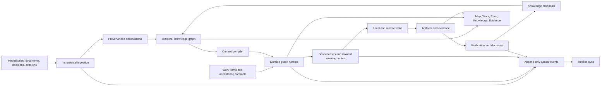

# RFC: Charon Workspace

- Status: proposed
- Date: 2026-08-11
- Decision owner: Charon maintainers
- Contract: [`workspace.schema.json`](../contracts/workspace.schema.json)
- Dogfood workflow: [`charon-workspace-dogfood.json`](../../examples/graph_workflows/charon-workspace-dogfood.json)

## Summary

Charon Workspace is a local-first institutional context and coordinated-delivery
control plane. It turns a collection of repositories, documents, decisions,
sessions, agents, and remote workers into one inspectable system that can:

1. explain what the project is and how its parts relate;
2. compile the smallest useful, attributable context for each task;
3. coordinate concurrent agents without silent write collisions;
4. require evidence before work is considered complete;
5. preserve decisions and lessons without promoting unverified output to truth;
6. continue across local and remote replicas with durable, conflict-aware sync.

The core product loop is:

```text
understand -> plan -> coordinate -> execute -> prove -> learn
     ^                                                 |
     +-------------------------------------------------+
```

This is not a separate scheduler or a replacement for Charon's current memory,
session, graph, and fleet systems. It is the shared object model and product
surface that joins them into a closed loop.

## Decision

Build Workspace as a contract-first Charon subsystem with five commitments:

- The institutional model is a temporal, provenance-bearing graph, not a bag of
  generated summaries.
- Every agent run receives a persisted context manifest whose inputs, omissions,
  scores, budget, and digest can be inspected and reproduced.
- Work intent, execution attempts, sessions, leases, and evidence are distinct
  records linked through durable identifiers.
- Concurrent mutation is protected by scoped leases with fencing tokens and
  isolated working copies.
- Remote synchronization exchanges immutable events and content-addressed
  artifacts; ambiguous conflicts are surfaced rather than hidden by last-write
  wins.

## Capability thesis

Workspace should be more than a searchable catalog or project dashboard. Its
advantage comes from making knowledge operational and execution accountable.

| Capability | Basic implementation | Charon Workspace target |
|---|---|---|
| Project understanding | Pages and search results | Temporal entity graph with provenance, confidence, contradictions, and freshness |
| Agent context | A large retrieved prompt | Budgeted context manifest with reasons, exclusions, digests, and exact replay |
| Multi-agent work | Parallel task launch | Dependency graph, scoped leases, heartbeats, fencing, checkpoints, and bounded repair |
| Completion | Agent says it is done | Acceptance contract plus linked tests, inspections, diffs, and decisions |
| Learning | Append a generated note | Proposal, verification, contest, supersession, and expiry lifecycle |
| Remote work | Send a prompt and collect text | Durable task/session identity, resumable event sync, artifact integrity, and policy enforcement |
| Observability | Logs | One causal timeline spanning context, decisions, tool effects, artifacts, and outcomes |
| Improvement | Anecdotal preference | Versioned procedures evaluated against outcomes before promotion |

The result should answer not only “what do we know?” but also:

- Why does the system believe it?
- Was it true at the time relevant to this task?
- What was omitted from this agent's context, and why?
- Who or what is currently allowed to modify this scope?
- Which evidence proves that a work item is complete?
- Which decision or event caused the current state?
- Can another replica reconstruct the same result?

## Goals

- Give a person or agent a trustworthy map of an unfamiliar project in minutes.
- Coordinate several agents on one workspace while preventing accidental overlap.
- Make local and remote execution use the same work, context, evidence, and event
  contracts.
- Preserve useful institutional knowledge across agents, sessions, and machines.
- Keep every important state transition inspectable and recoverable.
- Remain useful without a hosted service or permanent network connection.
- Allow different agent runtimes and model endpoints behind a neutral execution
  adapter.

## Non-goals

- Replacing source control, document storage, or issue tracking systems.
- Treating generated prose as authoritative merely because an agent produced it.
- Centralizing all file contents in the workspace database.
- Letting the knowledge graph become an unbounded transcript archive.
- Building a general-purpose company directory in the first release.
- Requiring one user interface, execution engine, or remote transport.
- Automatically publishing learned procedures without review and evaluation.

## Open-source posture

- The complete local knowledge, context, work, lease, evidence, and sync loop
  belongs in the public core; no essential feature depends on a managed service.
- Schemas, state machines, event semantics, conformance fixtures, and migrations
  are public compatibility contracts.
- Source, execution, storage, transport, and user-interface integrations use
  documented adapter boundaries rather than privileged private hooks.
- Workspace bundles and artifacts remain exportable in documented formats, even
  when an installation uses a custom storage adapter.
- Contract changes follow proposal review, versioning, compatibility tests, and
  an announced migration window.
- Usage reporting is absent by default and requires explicit opt-in.
- The project maintains deterministic fixtures for third-party adapters to test
  without credentials or network access.

## Foundation already present in Charon

Workspace can be built incrementally because the difficult execution substrate is
already taking shape.

| Existing Charon capability | Workspace use | Required extension |
|---|---|---|
| Project registry | Resolve workspace identity and roots | Multiple roots, replica identity, workspace revision |
| Three-tier memory | Seed user, project, and agent context | Typed knowledge lifecycle, provenance, contradictions, expiry |
| Context assembler and compactor | Preserve conversational continuity | Deterministic cross-source context compiler and manifest |
| Goals, task queue, and task ledger | Dispatch and track agent work | Separate work intent from attempts; link acceptance and evidence |
| Durable graph control plane | Schedule dependencies, fan-out, joins, retries, and gates | Workspace-aware handlers and projections |
| Boundaries and scopes | Describe intended mutation surface | Enforced leases, conflict detection, and fencing tokens |
| Session grid and external session bridge | Observe and steer active workers | Stable session-to-task-to-artifact identity |
| Fleet dispatch and synchronization | Execute work on remote machines | Replica cursors, event convergence, resumable artifact transfer |
| Tool approvals | Confirm risky actions | Versioned workspace policy evaluated at every side-effect boundary |
| Graph Studio | Inspect workflow execution | Unified Workspace map, work, run, knowledge, and evidence views |

Relevant current designs are the [architecture overview](../architecture/charon-overview.md),
[three-tier memory](../three-tier-memory.md), [remote agent teams](../remote-agent-teams.md),
and [graph control plane](../architecture/graph-control-plane.md).

## Product model

Workspace has five first-class views backed by the same records.

### Map

Systems, packages, modules, data stores, interfaces, environments, owners,
documents, decisions, and their typed relationships. Every edge is attributable
and can be current, stale, contested, superseded, or retracted.

### Work

Objectives, initiatives, tasks, defects, decisions, reviews, dependencies,
acceptance criteria, assignments, scopes, and current blockers. A work item says
what outcome is wanted; it does not pretend that one execution attempt is the
outcome.

### Runs

Active and historical workflow graphs, task attempts, agents, sessions, leases,
checkpoints, intervention points, retries, budgets, and terminal results.

### Knowledge

Facts, decisions, constraints, procedures, preferences, risks, questions, and
lessons with provenance and lifecycle controls. Proposed knowledge remains
visibly proposed until a verification rule or person promotes it.

### Evidence

Artifacts, diffs, commands, test results, inspections, benchmarks, screenshots,
approvals, and delivery bundles linked to the acceptance criterion they support.

## Canonical records

The versioned JSON contract defines these records. Implementations may normalize
them into tables, but export and sync must preserve their semantics.

| Record | Purpose |
|---|---|
| `Workspace` | Identity, roots, active policies, home replica, and current revision |
| `Entity` | A durable thing in the institutional map |
| `Relation` | A typed, temporal edge between entities or a scalar claim |
| `Observation` | An extracted source assertion with capture time and provenance |
| `KnowledgeItem` | A curated interpretation with review state and evidence |
| `WorkItem` | Desired outcome, dependency, scope, and acceptance contract |
| `Run` | One durable workflow instance coordinating work |
| `Task` | One assigned execution attempt within a run |
| `Lease` | Time-bounded authority over a mutation scope |
| `Session` | A local or remote execution conversation/terminal identity |
| `Artifact` | An immutable or versioned output with digest and producer |
| `Skill` | A versioned executable or manual capability contract |
| `Policy` | Allow, deny, or approval rules over subjects, actions, and resources |
| `ContextManifest` | The exact, explained context compiled for one task |
| `Replica` | A trusted synchronization participant and its cursors |
| `Conflict` | An explicit unresolved divergence and its candidate variants |
| `Event` | An immutable causal state transition in one replica's sequence |

### Required invariants

1. IDs are stable and unique within a workspace.
2. Every mutable record carries a revision; commands compare the expected
   revision before committing.
3. Observed time and effective time are separate. “We learned this today” does
   not imply “this became true today.”
4. Every relation, observation, knowledge item, context entry, and artifact can
   point to its provenance.
5. A task may not mutate a protected scope without an active lease whose fencing
   token is current.
6. A lease owner must heartbeat or release the lease; expiry alone does not let
   an old owner commit after a new owner has acquired a higher token.
7. A work item reaches `done` only when all required acceptance criteria have
   supporting evidence and any required approval has been recorded.
8. Context manifests are immutable after dispatch. A retry may reuse a manifest
   or explicitly create a successor.
9. Events are append-only and hash-linked within each replica sequence.
10. Sync conflicts involving meaning, authority, or destructive state remain
    explicit conflict records until resolved.
11. Secrets are references to protected configuration, never event or artifact
    payloads.
12. Agent output enters knowledge as `proposed` unless an explicit policy proves
    or approves it.

## Architecture



### Component boundaries

The initial implementation should live under `src/charon/workspace/`:

```text
workspace/
├── models.py             # typed canonical records and validation
├── store.py              # transactions, revisions, indexes, projections
├── events.py             # append, hash chain, replay, subscriptions
├── ingest.py             # source adapter contract and incremental planner
├── graph.py              # entities, relations, observations, contradictions
├── knowledge.py          # proposal/review/supersession/expiry lifecycle
├── context.py            # retrieval, ranking, packing, manifest creation
├── work.py               # work item, task, acceptance, and evidence lifecycle
├── leases.py             # overlap detection, heartbeat, fencing, release
├── artifacts.py          # content-addressed artifact metadata and integrity
├── sync.py               # replica cursors, event exchange, conflict records
├── policy.py             # authorization and approval decisions
├── projections.py        # presentation-neutral read models
└── adapters/             # repository, document, session, fleet, graph bridges
```

No module above owns agent execution. The existing graph runtime and task queue
remain authoritative; Workspace adapters translate canonical records into their
current dispatch contracts and ingest results back into the canonical model.

## Institutional knowledge pipeline

### 1. Ingest observations, not truth

Each source adapter emits observations containing:

- subject, predicate, and value;
- exact source locator and content digest;
- observed time and, when knowable, effective interval;
- extractor identity and version;
- confidence and redaction classification.

Ingestion is incremental. A planner compares source digests and extractor
versions, then touches only changed sources and affected relationships.

### 2. Separate extraction from curation

Observations may disagree. The graph retains both and creates a contradiction
link. A policy or reviewer can promote one interpretation into a verified
knowledge item while preserving the losing evidence and history.

### 3. Make freshness queryable

Every source-backed record has a freshness state:

- `current`: source digest still matches;
- `stale`: source changed or its validation horizon passed;
- `contested`: credible evidence disagrees;
- `retracted`: source or reviewer invalidated it;
- `superseded`: a newer record intentionally replaces it.

Stale information can still be retrieved, but it must be labeled and penalized.

### 4. Treat procedures as evaluated assets

A successful run may propose a procedure containing prerequisites, ordered
steps, policy requirements, expected evidence, and known failure modes. It is
promoted only after replay or repeated outcomes meet a configured threshold.
Procedure versions remain immutable and can be rolled back independently.

## Reproducible context compiler

The context compiler replaces opaque “retrieve some relevant text” behavior
with a deterministic and inspectable build.

### Inputs

- task intent, work item, acceptance criteria, and mutation scope;
- workspace revision and replica cursor;
- relevant entities and graph neighborhood;
- verified and proposed knowledge, with policy-dependent weighting;
- current run, dependency, lease, and peer-agent state;
- session history and compacted summaries;
- token or byte budget and required context sections;
- visibility and tool policies for the assigned agent.

### Build algorithm

1. Apply hard filters for workspace, visibility, validity time, and policy.
2. Generate candidates through exact identifiers, lexical retrieval, graph
   traversal, semantic retrieval, dependency links, and recent causal events.
3. Score candidates using relevance, authority, freshness, confidence,
   dependency distance, task scope, and contradiction penalties.
4. Reserve space for mandatory instructions, acceptance criteria, active leases,
   and known hazards.
5. Pack remaining candidates by marginal utility, deduplicating equivalent
   claims and preferring primary evidence over summaries.
6. Persist selected entries and exclusions with score components and reasons.
7. Hash the normalized manifest and attach it to the task before dispatch.

### Context manifest requirements

A manifest records:

- compiler name and version;
- exact workspace revision and event cursor;
- query, task, policies, and budget;
- ordered entries with record revision, digest, representation, score, and reason;
- excluded candidates with exclusion reason;
- total budget used and manifest digest.

This makes context quality measurable. A failed task can be analyzed against what
the worker actually saw rather than the workspace's current state.

## Coordinated delivery protocol

### Work item versus task versus run

- A `WorkItem` is durable intent and acceptance criteria.
- A `Run` is one workflow attempting to advance one or more work items.
- A `Task` is one assigned execution attempt inside a run.
- A `Session` is the interactive or automated channel through which a task runs.

Retries create new task attempts or visits without erasing earlier results.

### Scope planning and leases

Before dispatch, the coordinator proposes read and write scopes using paths,
entities, resources, or work-item identifiers. The lease manager normalizes them
and checks overlap.

Lease acquisition is compare-and-swap:

1. validate policy and requested scope;
2. reject or queue conflicts;
3. allocate a monotonically increasing fencing token for the resource;
4. persist the lease before task dispatch;
5. require the task to present that token at checkpoint and integration time;
6. expire or revoke abandoned leases, but reject late commits from older tokens.

Shared leases permit declared read-only work. Exclusive leases protect mutation.
Cross-scope dependencies can be coordinated without granting broad repository
ownership.

### Isolated execution and integration

Each mutating task receives an isolated working copy based on a recorded source
revision. A checkpoint contains:

- base and result revisions;
- changed paths and semantic scopes;
- lease tokens used;
- context manifest digest;
- validation commands and results;
- produced artifacts and unresolved risks.

Integration is its own task. It verifies lease fencing, rebases or merges through
the source-control adapter, reruns affected acceptance checks, and records the
decision. A worker never marks the parent work item complete merely by producing
a patch.

### Evidence-driven completion

Acceptance criteria are structured records. Each criterion declares a verifier
kind, whether it is required, and the evidence expected. Evidence may be
automated or reviewed by a person, but it must link to the exact task attempt,
artifact digest, and source revision it evaluated.

If required evidence is missing, the run remains `blocked` or enters a repair
branch. It does not silently become successful.

## Remote replicas and synchronization

Workspace uses an event-and-artifact sync protocol rather than copying a mutable
database file.

### Replica contract

Each trusted replica has a durable identity and maintains a cursor map of
`replica_id -> highest contiguous sequence`. Events are identified by replica
and sequence, hash-linked within that sequence, and globally deduplicated by
event ID.

A sync exchange:

1. authenticates the peer and evaluates replication policy;
2. exchanges cursor maps;
3. streams missing events in bounded batches;
4. verifies sequence, previous digest, payload digest, and referenced record
   revisions;
5. requests missing content-addressed artifacts;
6. applies deterministic projections;
7. emits explicit conflict records for ambiguous concurrent mutations;
8. advances cursors only after durable commit.

Interrupted transfers resume from the last contiguous cursor. A relay may be
used, but no relay is authoritative over the workspace's meaning.

### Conflict rules

- Immutable additions merge by ID and digest.
- Duplicate events with identical digests are idempotent.
- Lifecycle transitions use allowed state machines and expected revisions.
- Lease mutations use fencing tokens; the highest valid token wins authority,
  while rejected late commits remain visible in the audit trail.
- Concurrent edits to descriptive fields produce a merge conflict record.
- Conflicting knowledge claims become contested knowledge, not overwritten text.
- Policy, trust, and deletion conflicts require explicit approval.

## Security and trust model

Workspace will aggregate unusually sensitive context, so security is part of the
data model rather than an interface afterthought.

- Local storage and local execution are the default.
- Every actor, replica, skill, and task has explicit capabilities.
- Policies are evaluated before retrieval, dispatch, network access, artifact
  export, lease acquisition, and side effects.
- Untrusted source content is data, never executable instruction.
- Ingestion records redaction classification and can store only a digest and
  locator for protected content.
- Credentials are referenced through protected configuration and never copied
  into manifests, events, logs, or artifacts.
- Remote peers receive only records and artifacts permitted by replication
  policy.
- Destructive actions and trust changes can require human approval.
- Audit events are append-only and integrity checked.
- Artifact extraction and previews run with bounded resources and restricted
  capabilities.

## Interfaces

### Command line

The first stable commands should be:

```text
charon workspace init
charon workspace doctor
charon workspace ingest [--changed]
charon workspace map [ENTITY]
charon workspace query QUERY [--at TIME]
charon context build --task TASK_ID [--explain]
charon context show MANIFEST_ID
charon work create|show|list|claim|block|complete
charon lease acquire|heartbeat|release|list
charon knowledge propose|verify|contest|supersede
charon evidence attach|verify
charon sync status|pull|push
```

Mutation commands accept an idempotency key and expected record revision.

### Structured agent interface

Expose the same operations as typed resources and tools:

- search/map entities and relations;
- retrieve knowledge with provenance and time filters;
- compile and explain task context;
- create/claim/update work items;
- acquire/heartbeat/release leases;
- attach checkpoints and evidence;
- propose knowledge and request verification;
- inspect runs, sessions, conflicts, and replica health.

Agents receive narrow task-scoped capabilities, not blanket workspace access.

### User interface

The terminal and graphical surfaces should consume presentation-neutral
projections. Both must support:

- cross-linking Map, Work, Runs, Knowledge, and Evidence;
- a causal timeline for any selected record;
- context-manifest inspection, including omitted candidates;
- active lease and conflict visibility;
- human gates and knowledge review inboxes;
- recovery actions with clear predicted effects.

## Storage layout

The canonical contract does not require one storage engine. The first local
implementation should use Charon's transactional store and write-ahead behavior,
with human-readable exports:

```text
.charon_state/projects/<workspace-id>/workspace/
├── workspace.json
├── workspace.db
├── events/<replica-id>.jsonl
├── artifacts/sha256/<digest>
├── manifests/<manifest-id>.json
├── exports/current.bundle.json
└── conflicts/<conflict-id>.json
```

The database is the transactional projection. Replica event streams are the sync
and audit contract. Export bundles are portability artifacts, not live locks or
restart cursors.

## Delivery plan

Each increment must be independently useful and preserve current Charon behavior.

### Increment 0 — Contract and vertical slice

Build:

- canonical record types, validators, migrations, and bundle import/export;
- workspace identity and revision service;
- append-only local event writer with per-replica hash chain;
- one end-to-end slice: create work item -> compile static manifest -> dispatch a
  graph task -> attach evidence -> complete work item;
- contract tests using the checked-in example bundle.

Exit criteria:

- schema and implementation reject unknown fields and invalid transitions;
- the vertical slice survives process restart and idempotent replay;
- every resulting record is reachable from a work item or workspace root;
- current task queue and graph tests remain unchanged and green.

### Increment 1 — Institutional map

Build:

- incremental source adapter API and adapters for repository structure,
  dependency declarations, documentation, decisions, and ownership hints;
- entity/relation/observation indexes and provenance inspection;
- stale-source detection and contradiction records;
- Map projection and query commands.

Exit criteria:

- a changed source only reprocesses affected inputs;
- every displayed edge resolves to source evidence;
- deleting or changing a source marks dependent observations stale without
  erasing history;
- an unfamiliar evaluator can answer a fixed architecture questionnaire from
  the map with cited records.

### Increment 2 — Context compiler and knowledge lifecycle

Build:

- candidate generators, graph traversal, deterministic ranking, budget packing,
  and manifest hashing;
- integration with current system-prompt and compaction paths;
- knowledge proposal, verification, contest, supersession, and expiry flows;
- context explanation and review views;
- offline evaluation corpus from successful and failed historical tasks.

Exit criteria:

- identical inputs produce an identical manifest digest;
- policy-restricted content never enters a manifest;
- every selected and excluded item has an explanation;
- context evaluation improves task success or reduces context size against the
  current assembler without increasing unsupported claims.

### Increment 3 — Multi-agent delivery harness

Build:

- work item/task/run bridges to the durable graph runtime;
- normalized read/write scopes, lease manager, heartbeats, fencing, and expiry;
- isolated working-copy adapter and integration checkpoints;
- structured acceptance criteria and evidence gates;
- Work, Runs, and Evidence projections.

Exit criteria:

- overlapping exclusive scopes cannot be active simultaneously;
- a task holding an expired token cannot integrate after a successor is leased;
- independent tasks fan out and join through the current graph runtime;
- parent completion is impossible without all required evidence;
- a killed coordinator resumes without duplicate task dispatch.

### Increment 4 — Remote convergence and policy

Build:

- replica enrollment, cursor exchange, resumable event batches, artifact transfer,
  and integrity checks;
- deterministic projections and explicit sync conflict records;
- capability policy and approval evaluation at every boundary;
- fleet adapter using canonical tasks, manifests, sessions, and evidence;
- replica and policy health views.

Exit criteria:

- two disconnected replicas converge after reconnecting;
- repeated or reordered batches are idempotent;
- corrupted event chains and artifacts fail closed;
- policy prevents unauthorized context, artifacts, tasks, and lease mutations;
- remote task state remains traceable after either side restarts.

### Increment 5 — Learning and operational hardening

Build:

- procedure proposals derived from successful runs;
- replay/evaluation gates and versioned promotion;
- context, coordination, and outcome metrics;
- retention, archival, repair, and disaster-recovery tooling;
- performance budgets and incremental projection rebuilds.

Exit criteria:

- no procedure becomes active without evaluation and approval policy;
- promoted procedures outperform or match their baseline on held-out tasks;
- a workspace can rebuild projections from checked event streams and artifacts;
- scale tests meet the budgets below.

## Performance and quality budgets

Initial budgets should be measured on a medium workspace and revised from real
traces:

- warm entity lookup: p95 below 50 ms;
- changed-source ingest plan: p95 below 500 ms before extraction;
- context manifest build: p95 below 2 s excluding optional remote inference;
- work/lease mutation: p95 below 100 ms locally;
- active-run projection refresh: below 250 ms for 1,000 visible nodes;
- restart recovery: no duplicate side effect for an acknowledged idempotency key;
- sync: bounded memory with batches resumable at every committed cursor;
- provenance coverage: 100% for externally asserted relations and knowledge;
- required-evidence coverage: 100% for completed work items.

## Evaluation plan

Track quality with reproducible scenarios rather than screenshots alone.

### Understanding

- time to locate an owner, dependency, decision, and operational procedure;
- factual precision and provenance coverage;
- stale and contradictory claim detection rate.

### Context

- task success at fixed context budgets;
- relevant-evidence recall and irrelevant-context rate;
- manifest reproducibility and explanation usefulness;
- unsupported-claim rate after compaction and retrieval.

### Coordination

- parallel speedup for independent workstreams;
- prevented write collisions and false-positive lease conflicts;
- duplicate dispatch rate after crashes;
- mean time from blocker creation to responsible actor notification.

### Delivery

- acceptance criteria with valid evidence;
- defects escaping a successful gate;
- repair-loop count and time to verified completion;
- ability to reproduce a decision from its context and evidence.

### Sync and recovery

- convergence under interruption, duplication, and reordering;
- explicit versus silently lost conflicts;
- artifact integrity failures detected;
- projection rebuild equivalence.

## Dogfood strategy

Charon Workspace should be built through the control plane it is extending.
The checked-in workflow template coordinates four bounded workstreams:

1. contract and storage foundation;
2. knowledge graph and context compiler;
3. work, lease, and evidence coordination;
4. replica sync, trust, and policy.

They join at an integration task, pass through independent verification, and
require a human acceptance gate. Rejection enters a bounded repair loop. Each
worker has an explicit non-overlapping scope and must return evidence.

Before running the template, bind its placeholder agent IDs to active agents and
create the named work item. The template intentionally uses only existing graph
handlers, so it exercises the current durable scheduler and queue adapter while
the new Workspace-aware handlers are developed.

## Risks and mitigations

| Risk | Mitigation |
|---|---|
| Knowledge graph becomes noisy or expensive | Separate observations from curated knowledge; incremental extraction; retention and confidence thresholds |
| Agents optimize for recorded metrics | Use several outcome measures, held-out tasks, and human review for promotion |
| Lease system blocks useful concurrency | Normalize scopes, support shared reads, allow explicit split/override with audited approval |
| Remote conflicts become incomprehensible | Deterministic rules, causal timelines, conflict records, and guided resolution |
| Context compiler hides important information | Mandatory sections, exclusion explanations, recall tooling, and offline ablations |
| New layer duplicates existing state | Adapters first, one authority per lifecycle, and migration parity tests |
| Sensitive information spreads through sync | Classification at ingestion, least-privilege manifests, replication policy, redaction, and digest-only references |
| Scope expands into a monolithic platform | Ship vertical increments; keep source systems authoritative; enforce module and contract boundaries |

## Resolved design choices

- **One shared record model:** knowledge, work, sessions, and evidence use stable
  references rather than separate feature-specific identifiers.
- **Current graph runtime remains the scheduler:** Workspace adds handlers and
  projections instead of another orchestration engine.
- **Events are per-replica ordered:** this permits offline work without pretending
  there is a global clock.
- **Conflicts are domain-aware:** knowledge disagreement differs from a lease
  fencing violation and must not use the same merge rule.
- **Context is an artifact:** manifests are immutable, digestible, comparable,
  and attached before execution.
- **Evidence is part of state transition:** completion checks do not depend on a
  prose summary.
- **Learning is gated:** outcomes can propose knowledge and procedures but cannot
  silently rewrite policy or canonical truth.

## Open implementation questions

These do not block Increment 0, but must be settled through small prototypes:

1. Which graph neighborhoods produce the best context utility per token for
   different task classes?
2. Should very large artifacts be stored by Workspace or only referenced through
   pluggable content stores?
3. Which source mutations can be merged structurally, and which should always
   become explicit conflicts?
4. What is the smallest safe lease granularity for generated files and shared
   manifests?
5. How long should unverified observations and expired context manifests remain
   in the fast local projection?
6. Which outcome signals are reliable enough to promote a procedure without a
   bespoke human review?

## Definition of first public release

The first public release is ready when a fresh Charon installation can:

1. initialize a workspace from an existing project;
2. build an attributable system map incrementally;
3. create a work item with structured acceptance criteria;
4. compile and inspect a reproducible context manifest;
5. coordinate at least three concurrent agents with enforced leases;
6. collect checkpoints and evidence through a durable graph;
7. prevent completion when required evidence is absent;
8. resume after interruption without duplicate dispatch;
9. synchronize with a remote replica and surface a deliberate conflict;
10. promote a verified result into knowledge while preserving its provenance.

That release demonstrates the full closed loop. Later releases can deepen source
adapters, projections, evaluation, and scale without changing the fundamental
contracts.
